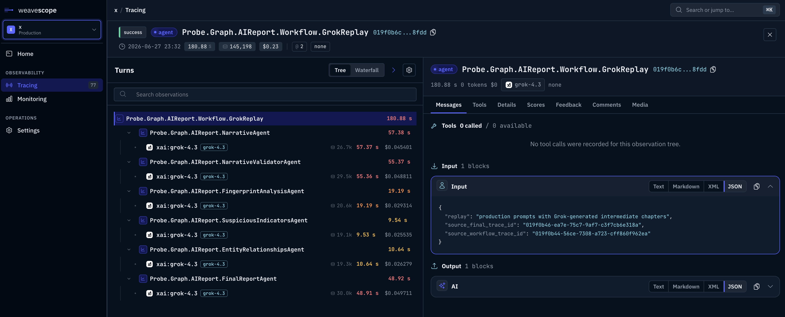

# BeamWeaver

[](https://github.com/caudena/beam_weaver/actions/workflows/ci.yml)

Elixir-native LangChain, LangGraph, and Deep Agents for traceable LLM apps:
OTP workflows, tools, memory, human-in-the-loop, streaming, custom
clients/adapters, minimal deps, and WeaveScope tracing.

BeamWeaver brings the practical parts of LangChain, LangGraph, and Deep Agents
to the BEAM without a Python runtime, hosted control plane, or framework lock-in.
Agents, tools, graph workflows, subagents, memory, persistence, retrieval,
structured output, streaming, and tracing are native Elixir modules built around
OTP supervision, explicit adapters, tagged errors, telemetry, and Ecto/ETS
storage boundaries.

It is not a Python wrapper. It is an Elixir library designed for applications
that already rely on OTP, supervision trees, Ecto, telemetry, and explicit
runtime boundaries.

BeamWeaver is not affiliated with LangChain.

Documentation: [weavescope.gitbook.io/beam_weaver](https://weavescope.gitbook.io/beam_weaver/)

## Why Switch To BeamWeaver

- **Elixir-native runtime:** build agents and workflows inside your existing
  OTP supervision tree instead of running a separate Python service.
- **One system for agents and graphs:** use the agent DSL for common model/tool
  loops, or drop to graph workflows for deterministic branching, fan-out,
  interrupts, time travel, and durable execution.
- **Traceability from day one:** local traces, typed event streams, token and
  cost metadata, redaction, and native queued export to WeaveScope.
- **Bring your own boundaries:** use built-in provider adapters or plug in your
  own clients, transports, models, tools, filesystems, stores, and sandboxes.
- **Production state:** checkpoints, memory, caches, record managers, vector
  stores, and replay transports with ETS and Ecto-backed adapters.
- **Small dependency surface:** no app framework requirement, no Python sidecar,
  and no hidden hosted runtime.

## What You Can Build

- Customer support agents with tools, structured output, memory, and traceable
  model calls.
- Durable multi-step workflows with graph state, checkpoints, retries,
  interrupts, time travel, and resumable execution.
- Deep research and analysis agents with subagents, planning, virtual
  filesystems, skills, summarization, and sandboxed tool execution.
- Retrieval pipelines with document loading, splitting, embeddings, vector
  stores, record managers, and incremental indexing.
- Production LLM services with provider fallback, rate limits, redaction,
  telemetry, event streams, and WeaveScope tracing.

## Native WeaveScope Tracing

BeamWeaver traces agents, graphs, model calls, tool calls, subagents, retries,
token usage, costs, errors, custom fields, and run trees. Use it locally during
development, or configure WeaveScope export when you want production traces your
team can inspect.



Configure WeaveScope once:

```elixir
config :beam_weaver,
  weave_scope: [
    endpoint: "https://app.weavescope.com",
    api_key: System.fetch_env!("WEAVESCOPE_API_KEY")
  ]
```

Then attach trace identity and custom fields at call sites. Put IDs and
dimensions you want to filter by in `fields`; keep extra, non-indexed context in
`metadata`.

```elixir
def run_report(report, user) do
  input = %{
    topic: report.topic,
    sources: report.source_urls,
    audience: report.audience
  }

  MyApp.Agents.ReportAgent.invoke(input,
    trace: [
      name: "report.workflow",
      user_id: user.id,
      thread_id: report.id,
      execution_mode: "production",
      fields: %{
        account_id: user.account_id,
        project_id: report.project_id,
        report_id: report.id,
        plan: user.plan,
        source_count: length(input.sources)
      },
      metadata: %{trigger: "scheduled_report"}
    ]
  )
end
```

## Core Capabilities

| Capability | What BeamWeaver Provides |
| --- | --- |
| Agents | Module-defined agents and runtime-built agents with tools, middleware, structured output, memory, and HITL interrupts. |
| Graph workflows | LangGraph-style state graphs with reducers, commands, subgraphs, checkpoints, pending writes, and durable execution. |
| Deep agents | Planning tools, TODO state, virtual filesystems, skills, subagents, async subagents, context engineering, and summarization. |
| Models | Provider adapters, model profiles, parameter validation, prompt caching, streaming, structured output, token usage, and cost metadata. |
| Tools | Typed tools, injected runtime arguments, tool nodes, tool middleware, shell/filesystem tools, and tool-call tracing. |
| Retrieval | Document loaders, text splitters, embeddings, vector stores, retrievers, record managers, and indexing flows. |
| Persistence | ETS and Ecto-backed memory, checkpoints, caches, record managers, and vector stores. |
| Observability | Local run trees, typed event streams, telemetry, redaction, and native WeaveScope export. |

## Supported Providers And Models

BeamWeaver ships checked-in model profiles for current provider families and
permissive fallback profiles for future compatible IDs. Use explicit provider
prefixes when a model name is ambiguous.

| Provider | Supported examples |
| --- | --- |
| OpenAI | `openai:gpt-5.5`, `openai:gpt-5.5-pro`, `openai:gpt-5.4`, `openai:gpt-5.4-mini`, `openai:gpt-5`, `openai:gpt-4.1`, `openai:text-embedding-3-large`, `openai:text-embedding-3-small` |
| Anthropic | `anthropic:claude-sonnet-5`, `anthropic:claude-opus-4-8`, `anthropic:claude-opus-4-7`, `anthropic:claude-opus-4-6`, `anthropic:claude-opus-4-5`, `anthropic:claude-sonnet-4-6`, `anthropic:claude-sonnet-4-5`, `anthropic:claude-haiku-4-5`, `anthropic:claude-fable-5`, `anthropic:claude-mythos-5` |
| Google Gemini | `google:gemini-3.5-flash`, `google:gemini-3.1-pro-preview` |
| Moonshot/Kimi | `moonshot:kimi-k2.7-code`, `moonshot:kimi-k2.7-code-highspeed`, `moonshot:kimi-k2.6`, `moonshot:kimi-k2.5` |
| xAI | `xai:grok-4.3`, `xai:grok-4.20-0309-reasoning`, `xai:grok-4.20-0309-non-reasoning`, `xai:grok-4.20-multi-agent-0309`, `xai:grok-build-0.1`, `xai:v1` embeddings |
| Z.ai | `zai:glm-5.2` |
| Test models | Fake chat and embedding models, plus replay transports for deterministic provider tests. |

Inspect the exact profile set in your checkout:

```bash
mix beam_weaver.models.profiles
```

## Install

Add BeamWeaver to your application:

```elixir
def deps do
  [
    {:beam_weaver, "~> 0.1.9"}
  ]
end
```

Configure only the providers you use:

```elixir
config :beam_weaver,
  openai: [api_key: System.fetch_env!("OPENAI_API_KEY")],
  anthropic: [api_key: System.fetch_env!("ANTHROPIC_API_KEY")],
  google: [api_key: System.fetch_env!("GOOGLE_API_KEY")],
  xai: [api_key: System.fetch_env!("XAI_API_KEY")],
  moonshot: [api_key: System.fetch_env!("MOONSHOT_API_KEY")],
  zai: [api_key: System.fetch_env!("ZAI_API_KEY")]
```

## Quickstart

Start with the module DSL for application code. The DSL keeps the agent's model,
prompt, tools, middleware, memory, and harness-style capabilities in one module,
so a reader can see what the agent does without chasing a runtime options map.
It also makes the common path much easier: adding planning, prompt caching,
conversation compaction, overflow recovery, filesystems, or subagents is a
declaration instead of custom orchestration code.

```elixir
defmodule MyApp.Agents.SupportAgent do
  use BeamWeaver.Agent

  alias BeamWeaver.Agent.Middleware
  alias BeamWeaver.Core.Message

  name "support.reply"
  description "Answer customer support questions with account context."

  model "openai:gpt-5.4-mini", temperature: 0.2, timeout: 30_000
  system_prompt "Answer support questions clearly. Ask for missing details."

  # Agent harness capabilities are regular declarations.
  prompt_caching true
  compact_conversation true
  overflow_recovery true

  middleware do
    use Middleware.TodoList, tool_name: "write_todos"
    use Middleware.ToolCallNormalization
    use Middleware.StructuredOutputRetry, max_retries: 2
    use Middleware.ModelRetry, max_retries: 2, initial_delay: 100, retry_on: :transient
    use Middleware.ToolRetry, max_retries: 1, on_failure: :continue
    use Middleware.ToolCallLimit, run_limit: 8, exit_behavior: :end
    use Middleware.ToolSelection, deny: ["internal_admin_tool"]
    use Middleware.PII, detectors: [:email, :credit_card], strategy: :redact
  end

  def run(question, user) do
    __MODULE__.invoke(%{messages: [Message.user(question)]},
      trace: [
        name: "support.reply",
        user_id: user.id,
        execution_mode: "support_reply",
        fields: %{account_id: user.account_id}
      ]
    )
  end
end
```

Use `BeamWeaver.Agent.build/1` when the agent shape is dynamic or generated from
configuration:

```elixir
defmodule MyApp.DynamicSupportAgent do
  alias BeamWeaver.Agent
  alias BeamWeaver.Core.Message

  def run(question, user) do
    model =
      BeamWeaver.Models.init_chat_model!("openai:gpt-5.4-mini",
        temperature: 0.2,
        timeout: 30_000
      )

    {:ok, agent} =
      Agent.build(
        name: "support.reply",
        model: model,
        system_prompt: "Answer support questions clearly."
      )

    Agent.invoke(agent, %{messages: [Message.user(question)]},
      trace: [
        name: "support.reply",
        user_id: user.id,
        execution_mode: "support_reply",
        fields: %{account_id: user.account_id}
      ]
    )
  end
end
```

## Observability With WeaveScope

Tracing is local by default. Add WeaveScope credentials when you want run trees,
model calls, tool calls, token usage, costs, errors, and custom fields in the
WeaveScope UI. BeamWeaver automatically uses the queued WeaveScope exporter when
both `endpoint` and `api_key` are configured. Use `trace:` on agent, graph,
runnable, model, or tool calls to attach application identity such as `user_id`,
`thread_id`, `execution_mode`, and indexed custom fields.

## Documentation

Start here:

- [Getting Started](docs/getting_started.md)
- [Thinking In BeamWeaver](docs/thinking_in_beamweaver.md)
- [Workflows And Agents](docs/workflows_and_agents.md)
- [Deep Agents Quickstart](docs/deep_agents_quickstart.md)
- [Models](docs/models.md)
- [Tracing](docs/tracing.md)
- [Going To Production](docs/going_to_production.md)

Core guides:

- [Agents](docs/agents.md)
- [Graph](docs/graph.md)
- [Tools](docs/tools.md)
- [Messages](docs/messages.md)
- [Middleware](docs/middleware.md)
- [Structured Output](docs/structured_output.md)
- [Event Streaming](docs/event_streaming.md)
- [Persistence](docs/persistence.md)
- [Memory](docs/memory.md)
- [Retrieval](docs/retrieval.md)
- [Filesystem](docs/filesystem.md)
- [Sandboxes](docs/sandboxes.md)
- [Subagents](docs/subagents.md)
- [Human-In-The-Loop](docs/human_in_the_loop.md)

Provider guides:

- [OpenAI](docs/partners/openai.md)
- [Anthropic](docs/partners/anthropic.md)
- [Google](docs/partners/google.md)
- [Moonshot/Kimi](docs/partners/moonshot.md)
- [xAI](docs/partners/xai.md)
- [Z.ai](docs/partners/zai.md)
