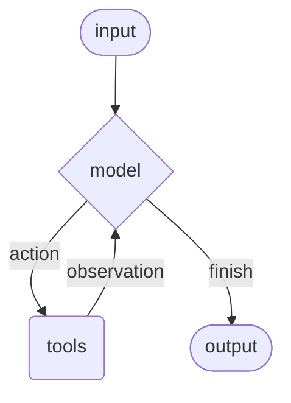

# Agents

Agents combine chat models with tools to build systems that can reason about a
task, choose actions, observe tool results, and continue until a final response
or stop condition is reached.

BeamWeaver agents are graph-backed. The public API is Elixir-native:
`use BeamWeaver.Agent` for application modules and `BeamWeaver.Agent.build/1`
for runtime-configured agents. Both compile to the same `BeamWeaver.Graph`
runtime with a model node, optional tool node, middleware nodes, checkpoints,
interrupts, typed streams, and tagged errors.



## Core Components

### Model

The model is the reasoning engine for the agent. BeamWeaver accepts any value
that implements `BeamWeaver.Core.ChatModel`.

#### Static Model

Static models are configured once and used for every model call.

Use a provider-prefixed model identifier when you want BeamWeaver to construct
the model:

```elixir
model =
  BeamWeaver.Models.init_chat_model!("openai:gpt-5.4",
    temperature: 0.1,
    max_output_tokens: 1_000,
    timeout: 30_000
  )

{:ok, agent} =
  BeamWeaver.Agent.build(
    name: "support_agent",
    model: model,
    tools: []
  )
```

The model's `:timeout` is used twice in agent builds:

- Provider transport timeout: the HTTP receive budget passed to the model
  adapter.
- Agent model-node timeout: the graph node budget for the model call.

Agent model nodes are graph nodes, so they still have a hard execution budget.
BeamWeaver chooses the generated model node timeout in this order:

1. `model_opts[:timeout]` from `BeamWeaver.Agent.build/1` or the `model/2` DSL.
2. `model.timeout` when the configured model struct exposes a timeout field.
3. The graph node default of `5_000` milliseconds.

For long summarization, extraction, or tool-heavy calls, set the timeout on the
model or through `model_opts`:

```elixir
{:ok, agent} =
  BeamWeaver.Agent.build(
    model: "openai:gpt-5.4",
    model_opts: [
      timeout: 120_000,
      max_output_tokens: 2_000
    ],
    tools: []
  )
```

```elixir
defmodule MyApp.SummaryAgent do
  use BeamWeaver.Agent

  model "anthropic:claude-sonnet-4-6", timeout: 120_000
  tools []
end
```

`BeamWeaver.Agent.invoke(..., timeout: value)` is not the model-node timeout; it
is an invocation/server call option. When invoking through a supervised agent
server process, keep that call timeout at least as large as the model-node
timeout.

OpenAI identifiers can also be inferred:

```elixir
model = BeamWeaver.Models.init_chat_model!("gpt-5.4")
```

Google Gemini identifiers must be explicit:

```elixir
model = BeamWeaver.Models.init_chat_model!("google:gemini-3.5-flash")
```

For tests, examples, or local workflows, use the fake provider:

```elixir
model =
  BeamWeaver.Models.init_chat_model!("fake:chat",
    response: BeamWeaver.Core.Message.assistant("hello")
  )
```


**Provider Scope**

LangChain examples show many provider strings because Python integrations are
packaged independently. BeamWeaver documents an agent provider only after its
model, message translation, streaming behavior, tools, profiles, and
fake/replay tests have native coverage. Today that path exists for OpenAI,
Anthropic, Google Gemini, xAI, and fake models. Azure OpenAI, Vertex AI,
Bedrock, OpenRouter, Fireworks, Baseten, Ollama, and other provider-specific
translators need their own BeamWeaver adapters before they should be used as
supported agent models.


You can also configure an agent as a normal module:

```elixir
defmodule MyApp.SupportAgent do
  use BeamWeaver.Agent

  model BeamWeaver.Models.init_chat_model!("openai:gpt-5.4")
  tools []
end
```

#### Dynamic Model

Dynamic models are selected at the model-call boundary with middleware. Keep a
static default model on the agent, then override `%BeamWeaver.Agent.ModelRequest{}`
when runtime state or context calls for a different model:

```elixir
defmodule MyApp.DynamicModelSelection do
  @behaviour BeamWeaver.Agent.Middleware

  alias BeamWeaver.Agent.ModelRequest

  def wrap_model_call(%ModelRequest{} = request, handler) do
    model =
      if length(request.messages || []) > 10 do
        BeamWeaver.Models.init_chat_model!("openai:gpt-5.4")
      else
        BeamWeaver.Models.init_chat_model!("openai:gpt-5.4-mini")
      end

    request
    |> ModelRequest.override(model: model)
    |> handler.()
  end
end

defmodule MyApp.AgentWithDynamicModel do
  use BeamWeaver.Agent

  model BeamWeaver.Models.init_chat_model!("openai:gpt-5.4-mini")
  tools []
  middleware [MyApp.DynamicModelSelection]
end
```

When structured output is enabled, prefer unbound model instances. Let the agent
attach tools and response-format options at the model boundary.


**Dynamic Behavior Lives In Middleware**

LangChain often demonstrates dynamic model selection with decorators such as
`@wrap_model_call`. BeamWeaver uses middleware modules and structs for the
same lifecycle point. Keeping dynamic model selection in middleware makes the
execution stage explicit, keeps state/context access in one request struct, and
avoids a second function-valued model API beside normal model structs.


### Tools

Tools let an agent take actions. BeamWeaver agents support multiple tool calls
across the loop, parallel tool execution in the tool node, dynamic tool
selection, retry/error middleware, runtime state, and checkpoint persistence.

#### Static Tools

Static tools are declared up front.

```elixir
alias BeamWeaver.Core.Tool

search =
  Tool.from_function!(
    name: "search",
    description: "Search for information.",
    input_schema: %{
      "type" => "object",
      "required" => ["query"],
      "properties" => %{"query" => %{"type" => "string"}}
    },
    handler: fn %{"query" => query}, _opts ->
      "Results for: #{query}"
    end
  )

weather =
  Tool.from_function!(
    name: "get_weather",
    description: "Get weather information for a location.",
    input_schema: %{
      "type" => "object",
      "required" => ["location"],
      "properties" => %{"location" => %{"type" => "string"}}
    },
    handler: fn %{"location" => location}, _opts ->
      "Weather in #{location}: sunny, 72 F"
    end
  )

{:ok, agent} =
  BeamWeaver.Agent.build(
    model: BeamWeaver.Models.init_chat_model!("openai:gpt-5.4"),
    tools: [search, weather]
  )
```

If the tool list is empty, the compiled agent contains only the model path and
middleware path; it will not execute tool calls.

Tool modules are also supported:

```elixir
defmodule MyApp.Tools.GetWeather do
  use BeamWeaver.Tool

  name "get_weather"
  description "Get weather information for a location."

  schema do
    field :location, :string, required: true
  end

  @impl true
  def invoke(_tool, %{"location" => location}, _opts) do
    {:ok, "Weather in #{location}: sunny, 72 F"}
  end
end
```


**Tool Definition**

LangChain's Python `@tool` decorator attaches schema metadata to a Python
function object. Elixir functions do not carry mutable decorator metadata, and
macros should leave a clear compile-time shape. BeamWeaver therefore uses
`%BeamWeaver.Core.Tool{}` values for runtime-created tools and
`use BeamWeaver.Tool` modules for stable application tools.


#### Dynamic Tools

Dynamic tools are exposed to the model at runtime. This is useful for
permissions, feature flags, conversation phase, or tools discovered from an
external registry.

##### Filtering Pre-Registered Tools

When every possible tool is known at startup, use
`BeamWeaver.Agent.Middleware.ToolSelection` or custom `wrap_model_call/2`
middleware.

Filter by state:

```elixir
defmodule MyApp.StateBasedTools do
  @behaviour BeamWeaver.Agent.Middleware

  alias BeamWeaver.Agent.ModelRequest
  alias BeamWeaver.Core.Tool

  def wrap_model_call(%ModelRequest{} = request, handler) do
    authenticated? = Map.get(request.state || %{}, :authenticated, false)
    message_count = request.state |> Map.get(:messages, []) |> length()

    tools =
      cond do
        not authenticated? ->
          Enum.filter(request.tools, fn tool ->
            Tool.name(tool) |> String.starts_with?("public_")
          end)

        message_count < 5 ->
          Enum.reject(request.tools, &(Tool.name(&1) == "advanced_search"))

        true ->
          request.tools
      end

    request
    |> ModelRequest.override(tools: tools)
    |> handler.()
  end
end
```

Filter by store:

```elixir
defmodule MyApp.StoreBasedTools do
  @behaviour BeamWeaver.Agent.Middleware

  alias BeamWeaver.Agent.ModelRequest
  alias BeamWeaver.Core.Tool
  alias BeamWeaver.Memory

  def wrap_model_call(%ModelRequest{} = request, handler) do
    user_id = get_in(request.runtime.context || %{}, [:user_id])
    store = request.runtime.store

    tools =
      case Memory.get(store, ["features"], user_id) do
        {:ok, %{value: %{"enabled_tools" => enabled}}} ->
          Enum.filter(request.tools, &(Tool.name(&1) in enabled))

        _other ->
          request.tools
      end

    request
    |> ModelRequest.override(tools: tools)
    |> handler.()
  end
end

defmodule MyApp.StoreFilteredAgent do
  use BeamWeaver.Agent

  model BeamWeaver.Models.init_chat_model!("openai:gpt-5.4")
  tools [MyApp.Tools.Search, MyApp.Tools.Analyze, MyApp.Tools.Export]
  middleware [MyApp.StoreBasedTools]

  context_schema do
    field :user_id, :string, required: true
  end

  store BeamWeaver.Memory.ETS.new()
end
```

Filter by runtime context:

```elixir
defmodule MyApp.ContextBasedTools do
  @behaviour BeamWeaver.Agent.Middleware

  alias BeamWeaver.Agent.ModelRequest
  alias BeamWeaver.Core.Tool

  def wrap_model_call(%ModelRequest{} = request, handler) do
    role = Map.get(request.runtime.context || %{}, :user_role, "viewer")

    tools =
      case role do
        "admin" ->
          request.tools

        "editor" ->
          Enum.reject(request.tools, &(Tool.name(&1) == "delete_data"))

        _viewer ->
          Enum.filter(request.tools, fn tool ->
            Tool.name(tool) |> String.starts_with?("read_")
          end)
      end

    request
    |> ModelRequest.override(tools: tools)
    |> handler.()
  end
end
```

The built-in `ToolSelection` middleware covers common allow/deny/tag/metadata
filters and can also add tools dynamically:

```elixir
middleware [
  {BeamWeaver.Agent.Middleware.ToolSelection,
   allow: ["public_search"],
   deny: ["delete_data"],
   tools: &__MODULE__.tools_for_request/1}
]
```

##### Runtime Tool Registration

When a tool is discovered at runtime, add it before the model call and route it
before execution. The same middleware can own both hooks.

```elixir
defmodule MyApp.DynamicTipTool do
  @behaviour BeamWeaver.Agent.Middleware

  alias BeamWeaver.Agent.ModelRequest
  alias BeamWeaver.Agent.ToolCallRequest
  alias BeamWeaver.Core.Tool

  def wrap_model_call(%ModelRequest{} = request, handler) do
    request
    |> ModelRequest.override(tools: request.tools ++ [calculate_tip()])
    |> handler.()
  end

  def wrap_tool_call(%ToolCallRequest{tool_call: %{name: "calculate_tip"}} = request, handler) do
    request
    |> ToolCallRequest.override(tool: calculate_tip())
    |> handler.()
  end

  def wrap_tool_call(%ToolCallRequest{} = request, handler), do: handler.(request)

  defp calculate_tip do
    Tool.from_function!(
      name: "calculate_tip",
      description: "Calculate the tip and total for a bill.",
      input_schema: %{
        "type" => "object",
        "required" => ["bill_amount"],
        "properties" => %{
          "bill_amount" => %{"type" => "number"},
          "tip_percentage" => %{"type" => "number", "default" => 20}
        }
      },
      handler: fn args, _opts ->
        bill = args["bill_amount"]
        percent = Map.get(args, "tip_percentage", 20)
        tip = bill * percent / 100
        "Tip: #{Float.round(tip, 2)}, total: #{Float.round(bill + tip, 2)}"
      end
    )
  end
end
```

Registering the tool for the model is not enough. The tool node also needs a
tool value when execution starts, so runtime registration should pair
`wrap_model_call/2` with `wrap_tool_call/2`.

#### Tool Error Handling

Use `wrap_tool_call/2` to customize tool failures.

```elixir
defmodule MyApp.ToolErrors do
  @behaviour BeamWeaver.Agent.Middleware

  alias BeamWeaver.Agent.ToolCallRequest
  alias BeamWeaver.Core.Error
  alias BeamWeaver.Core.Message

  def wrap_tool_call(%ToolCallRequest{} = request, handler) do
    case handler.(request) do
      {:error, %Error{} = error} ->
        Message.tool(
          "Tool error: please check your input and try again. (#{error.message})",
          tool_call_id: tool_call_id(request)
        )

      other ->
        other
    end
  rescue
    exception ->
      Message.tool(
        "Tool error: please check your input and try again. (#{Exception.message(exception)})",
        tool_call_id: tool_call_id(request)
      )
  end

  defp tool_call_id(%ToolCallRequest{tool_call: call}) do
    Map.get(call, :id) || Map.get(call, "id")
  end
end
```

The returned `%BeamWeaver.Core.Message{role: :tool}` is appended to the agent
state and sent back to the model as the observation.

#### Tool Use In The ReAct Loop

The loop alternates between a model decision and tool observations:

1. The user message is added to agent state.
2. The model node reads `:messages` and returns an assistant message.
3. If the assistant message contains tool calls, the tool node executes them.
4. Tool results are appended as tool messages.
5. The model node runs again with the observations.
6. The loop stops when the assistant returns no pending tool calls or the
   recursion limit is reached.

```elixir
{:ok, %{messages: messages}} =
  MyApp.SupportAgent.invoke(%{
    messages: [BeamWeaver.Core.Message.user("Find headphones and check stock")]
  })

messages
|> List.last()
|> BeamWeaver.Core.Message.text()
```

### System Prompt

Use `system_prompt/1` to shape agent behavior:

```elixir
defmodule MyApp.ConciseAgent do
  use BeamWeaver.Agent

  model BeamWeaver.Models.init_chat_model!("openai:gpt-5.4")
  tools []
  system_prompt "You are a helpful assistant. Be concise and accurate."
end
```

You can also pass a system message:

```elixir
system_prompt BeamWeaver.Core.Message.system([
  %{type: :text, text: "You analyze literary works."},
  %{type: :text, text: "<full text of the work>", metadata: %{cache_hint: :ephemeral}}
])
```

Provider-specific metadata is passed through provider request builders only when
the configured provider supports it.

#### Dynamic System Prompt

Dynamic system prompts belong in middleware. This keeps prompt routing with the
stage of execution that owns it and avoids a second function-valued prompt API:

```elixir
middleware [
  {BeamWeaver.Agent.Middleware.DynamicPrompt,
   prompt: fn request ->
     case Map.get(request.runtime.context || %{}, :user_role, "user") do
       "expert" -> "You are helpful. Provide detailed technical responses."
       "beginner" -> "You are helpful. Explain concepts simply."
       _other -> "You are helpful."
     end
   end}
]
```

Use `DynamicPrompt` or custom middleware when prompt text depends on state or
runtime context.


**Prompt Routing**

LangChain can express dynamic prompts with decorators or callable prompt
values. BeamWeaver keeps prompt routing in middleware because middleware
already owns model-call context, request overrides, tracing metadata, and
state updates. Static prompt text remains an agent declaration; dynamic prompt
generation is model-call behavior.


### Name

Set a name for tracing metadata, graph names, and subgraph identifiers:

```elixir
defmodule MyApp.ResearchAssistant do
  use BeamWeaver.Agent

  name "research_assistant"
  model BeamWeaver.Models.init_chat_model!("openai:gpt-5.4")
  tools []
end
```

Prefer lowercase names with letters, numbers, underscores, or hyphens. Provider
tool-call APIs often reject spaces and special characters in agent or tool
names.

## Invocation

Invoke an agent by passing a state update. Agent state always includes
`:messages`.

```elixir
alias BeamWeaver.Core.Message

{:ok, result} =
  MyApp.SupportAgent.invoke(%{
    messages: [Message.user("What is the weather in San Francisco?")]
  })

result.messages |> List.last() |> Message.text()
```

To persist conversation history, provide a checkpointer and reuse the same
`thread_id`:

```elixir
alias BeamWeaver.Checkpoint.ETS, as: CheckpointETS
alias BeamWeaver.Core.Message

checkpointer = CheckpointETS.new()
thread_id = "thread-" <> Integer.to_string(System.unique_integer([:positive]))
config = %{"configurable" => %{"thread_id" => thread_id}}

{:ok, _first_turn} =
  MyApp.SupportAgent.invoke(
    %{messages: [Message.user("What is the weather in San Francisco?")]},
    checkpointer: checkpointer,
    config: config
  )

{:ok, follow_up} =
  MyApp.SupportAgent.invoke(
    %{messages: [Message.user("What about tomorrow?")]},
    checkpointer: checkpointer,
    config: config
  )
```

`thread_id` scopes the conversation and checkpoints. `context` carries per-run
data that tools and middleware can read:

```elixir
defmodule MyApp.UserScopedAgent do
  use BeamWeaver.Agent

  model BeamWeaver.Models.init_chat_model!("openai:gpt-5.4")
  tools []

  context_schema do
    field :user_id, :string, required: true
  end
end

{:ok, result} =
  MyApp.UserScopedAgent.invoke(
    %{messages: [BeamWeaver.Core.Message.user("Show my account summary")]},
    checkpointer: checkpointer,
    config: config,
    context: %{user_id: "user-123"}
  )
```

For durable deployments, use `BeamWeaver.Checkpoint.Ecto` instead of ETS.


**Deployment Boundary**

LangChain's hosted docs also discuss LangGraph Platform, SDK, CLI, and server
deployment behavior. BeamWeaver's local agent runtime is graph-backed and can
use ETS or Ecto/Postgres adapters, but it does not mirror the hosted platform
APIs. Use `BeamWeaver.Tracing` for local trace/export boundaries and your
normal OTP release/deployment tooling for services.


## Advanced Concepts

### Structured Output

Use `response_format/1` when the final agent state should include a
`:structured_response`. For the complete strategy and error-handling guide, see
[Structured Output](structured_output.md).


**Schema Inputs**

LangChain examples often use Pydantic models or `TypedDict` classes for agent
structured output. Those are Python runtime objects that LangChain can inspect
and convert to JSON Schema. Elixir structs and typespecs do not provide the
same runtime validation and field-description contract. BeamWeaver takes JSON
Schema maps directly, then lets provider strategies, tool strategies, and
Elixir validators handle runtime behavior.


#### Tool Strategy

Tool strategy asks the model to call a synthetic schema tool. This works with
models that support tool calling.

```elixir
alias BeamWeaver.Agent.StructuredOutput
alias BeamWeaver.Core.Message

defmodule MyApp.ContactAgent do
  use BeamWeaver.Agent

  @contact_schema %{
    "title" => "contact_info",
    "type" => "object",
    "required" => ["name", "email", "phone"],
    "properties" => %{
      "name" => %{"type" => "string"},
      "email" => %{"type" => "string"},
      "phone" => %{"type" => "string"}
    }
  }

  model BeamWeaver.Models.init_chat_model!("openai:gpt-5.4-mini")
  tools []
  response_format StructuredOutput.tool(@contact_schema)
end

{:ok, %{structured_response: contact}} =
  MyApp.ContactAgent.invoke(%{
    messages: [
      Message.user("Extract contact info: John Doe, john@example.com, 555-123-4567")
    ]
  })
```

#### Provider Strategy

Provider strategy uses provider-native structured output when the model supports
it:

```elixir
response_format BeamWeaver.Agent.StructuredOutput.provider(@contact_schema)
```

Passing a raw schema uses BeamWeaver's auto strategy. It selects provider-native
structured output when supported by the model profile and falls back to tool
strategy otherwise:

```elixir
response_format @contact_schema
```

### Memory

Agents keep conversation history in state and checkpoints. You can extend state
with additional short-term fields.

#### Defining State Via Middleware

Middleware-scoped state is preferred when the state exists for a specific
middleware/tool package.

```elixir
defmodule MyApp.PreferenceMiddleware do
  @behaviour BeamWeaver.Agent.Middleware

  def state_schema(_middleware) do
    %{
      user_preferences:
        BeamWeaver.Agent.Schema.field(:user_preferences, :map, required: false)
    }
  end

  def before_model(state, _runtime) do
    preferences = Map.get(state, :user_preferences, %{})
    Map.put(state, :user_preferences, Map.put_new(preferences, :style, "technical"))
  end
end

defmodule MyApp.PreferenceAgent do
  use BeamWeaver.Agent

  model BeamWeaver.Models.init_chat_model!("openai:gpt-5.4")
  tools []
  middleware [MyApp.PreferenceMiddleware]
end
```

Put state extensions on the middleware that owns the behavior so schema, hooks,
and tools stay together.


**Custom State Ownership**

LangChain documents two custom-state routes: middleware-owned state and
`state_schema` passed directly to `create_agent`. BeamWeaver keeps the
middleware-owned route for agents. In practice, custom agent state is almost
always read or written by specific middleware or tools, so colocating the
schema with that middleware reduces global agent configuration and keeps
ownership clear. Low-level graph schemas remain available in `BeamWeaver.Graph`
when you are building a graph directly.


For long-term memory shared across conversations, configure a store such as
`BeamWeaver.Memory.ETS` or `BeamWeaver.Memory.Ecto` and access it through
`runtime.store`.

### Streaming

Use `stream_events/2` to observe intermediate graph and model events.

```elixir
alias BeamWeaver.Core.Message
alias BeamWeaver.Stream.Envelope
alias BeamWeaver.Stream.Events

{:ok, events} =
  MyApp.SupportAgent.stream_events(
    %{messages: [Message.user("Search for AI news and summarize it")]}
  )

for %Envelope{event: event} <- events do
  case event do
    %Events.Message{message: message} ->
      IO.puts("Agent: " <> Message.text(message))

    %Events.ToolStart{tool_name: name} ->
      IO.puts("Calling tool: " <> name)

    %Events.ToolFinish{tool_name: name} ->
      IO.puts("Finished tool: " <> name)

    _other ->
      :ok
  end
end
```

If you need state-shaped updates instead of raw typed envelopes, project the
event list:

```elixir
alias BeamWeaver.Stream.Transformers

{:ok, events} = MyApp.SupportAgent.stream_events(%{messages: [Message.user("hello")]})
values = Transformers.stream(events, :values)
```


**Stream Shape**

LangChain streams can surface callback-style event dictionaries or state
chunks. BeamWeaver's primary stream surface is typed
`%BeamWeaver.Stream.Envelope{}` values, which are ordinary `Enumerable`
streams. Python's `stream_events(..., version="v3")` projection object is not
mirrored directly; use typed envelopes and projection reducers instead.


### Middleware

Middleware is ordinary Elixir data. A middleware entry can be a module, a struct,
or `{module, opts}`. Middleware can:

- process state before the agent or model runs
- modify the model request
- validate or rewrite model responses
- add or filter tools
- handle tool execution failures
- implement retry, fallback, call limits, summarization, PII handling,
  human-in-the-loop, and context editing
- return `BeamWeaver.Graph.Command` values for explicit jumps or state updates

The middleware behaviour supports these callbacks:

```elixir
@callback before_agent(map(), BeamWeaver.Graph.Runtime.t()) :: term()
@callback before_model(map(), BeamWeaver.Graph.Runtime.t()) :: term()
@callback wrap_model_call(BeamWeaver.Agent.ModelRequest.t(), function()) :: term()
@callback after_model(map(), BeamWeaver.Graph.Runtime.t()) :: term()
@callback wrap_tool_call(BeamWeaver.Agent.ToolCallRequest.t(), function()) :: term()
@callback after_agent(map(), BeamWeaver.Graph.Runtime.t()) :: term()
```

Common built-in middleware modules include:

- `BeamWeaver.Agent.Middleware.DynamicPrompt`
- `BeamWeaver.Agent.Middleware.ToolSelection`
- `BeamWeaver.Agent.Middleware.ToolRetry`
- `BeamWeaver.Agent.Middleware.ModelRetry`
- `BeamWeaver.Agent.Middleware.ModelFallback`
- `BeamWeaver.Agent.Middleware.ToolCallLimit`
- `BeamWeaver.Agent.Middleware.ModelCallLimit`
- `BeamWeaver.Agent.Middleware.Summarization`
- `BeamWeaver.Agent.Middleware.StructuredOutputRetry`
- `BeamWeaver.Agent.Middleware.HumanInTheLoop`
- `BeamWeaver.Agent.Middleware.ContextEditing`
- `BeamWeaver.Agent.Middleware.PII`
- `BeamWeaver.Agent.Middleware.TodoList`
- `BeamWeaver.Agent.Middleware.ShellTool`
- `BeamWeaver.Agent.Middleware.ToolEmulator`

See [Custom Middleware](custom_middleware.md) for implementing your own hooks.
See [Prebuilt Middleware](prebuilt_middleware.md) for configuration examples
and the places where BeamWeaver intentionally uses tools or graph composition
instead of Python middleware classes. See [Guardrails](guardrails.md) for
agent safety checks built from the same middleware lifecycle.

## Runtime-Built Agents

Prefer module-defined agents for stable application code. Use
`BeamWeaver.Agent.build/1` for config-driven or user-generated workflows.

```elixir
{:ok, agent} =
  BeamWeaver.Agent.build(
    name: "support_agent",
    model: BeamWeaver.Models.init_chat_model!("openai:gpt-5.4"),
    tools: [],
    system_prompt: "You are helpful."
  )

{:ok, state} =
  BeamWeaver.Agent.invoke(agent, %{
    messages: [BeamWeaver.Core.Message.user("hi")]
  })
```

Runtime-built agents support the same model/tools loop, schemas, middleware,
checkpointer, store, cache, interrupts, recursion limits, and event-streaming
options represented by `BeamWeaver.Agent.Spec`.

## Related Guides

- [Graph](graph.md)
- [Workflows And Agents](workflows_and_agents.md)
- [Context Engineering](context_engineering.md)
- [OpenAI](partners/openai.md)
- [Middleware](middleware.md)
- [Custom Middleware](custom_middleware.md)
- [Prebuilt Middleware](prebuilt_middleware.md)
- [Guardrails](guardrails.md)
- [Runtime](runtime.md)
- [Structured Output](structured_output.md)
- [Short-Term Memory](short_term_memory.md)
- [Long-Term Memory](long_term_memory.md)
- [Event Streaming](event_streaming.md)
- [Tracing](tracing.md)
- [Adapters](adapters.md)
