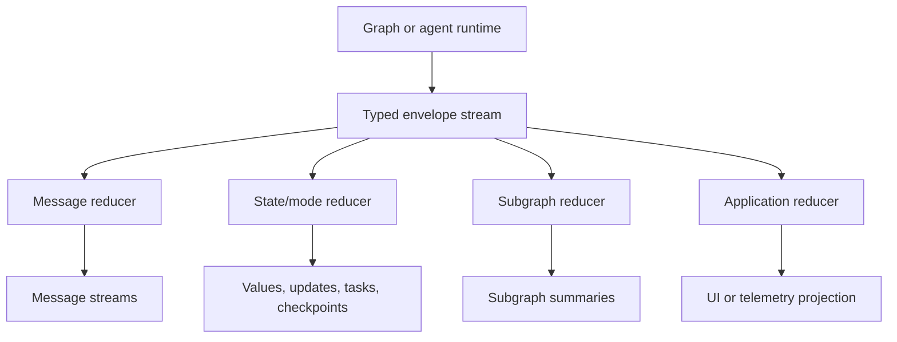

# Event Streaming

Event streaming lets applications observe model output, tool calls, graph state,
custom updates, subgraph activity, and completion metadata while an agent or
graph runs.

BeamWeaver's event stream is an `Enumerable` of typed
`%BeamWeaver.Stream.Envelope{}` values. Each envelope carries:

- `event`: a typed event struct from `BeamWeaver.Stream.Events`
- `run_id`, `graph`, `node`, `task_id`, and `step`
- `namespace`: the current graph or subgraph path
- `metadata`: provider, tracing, usage, tags, or app-specific metadata
- `timestamp`

For agents, use `BeamWeaver.Agent.stream_events/3`.
For compiled graphs, use `BeamWeaver.Graph.Compiled.stream_events/3`.
For standalone chat models, use `BeamWeaver.Core.ChatModel.stream_events/3`
when you need provider semantic events directly. Wrap model calls in an agent or
compiled graph when you want a unified typed envelope stream.

Standalone OpenAI, Anthropic, Google, and xAI model streams are lazy live
enumerables when using the live transport. Provider chunks are parsed
incrementally as server-sent events arrive. In tests, fake or replay transports
can emit deterministic typed stream events from fixtures. If a lazy provider
stream fails before any model output is emitted, consumers see an
`%BeamWeaver.Stream.Events.Error{}` item when they enumerate the stream.


**Versionless Typed Events**

LangChain's Python documentation recommends `stream_events(..., version="v3")`
and returns a run object with projection handles such as `stream.messages` and
`stream.tool_calls`. BeamWeaver does not use a stream protocol version argument.
The agent and graph public contract is the typed envelope stream itself.
Projections are normal Elixir reducers over that stream, which avoids shared
mutable projection objects and keeps cancellation, backpressure, and supervision
explicit.


## Quickstart

Build or define an agent, then stream typed events:

```elixir
alias BeamWeaver.Agent
alias BeamWeaver.Core.{Message, Tool}
alias BeamWeaver.Stream.Envelope
alias BeamWeaver.Stream.Events

weather_tool =
  Tool.from_function!(
    name: "get_weather",
    description: "Get weather for a city.",
    input_schema: %{
      "type" => "object",
      "properties" => %{"city" => %{"type" => "string"}},
      "required" => ["city"]
    },
    handler: fn %{"city" => city}, _opts ->
      "It's always sunny in #{city}!"
    end
  )

{:ok, agent} =
  Agent.build(
    model: BeamWeaver.Models.init_chat_model!("openai:gpt-5-nano"),
    tools: [weather_tool],
    name: "weather_agent"
  )

{:ok, events} =
  Agent.stream_events(
    agent,
    %{messages: [Message.user("What is the weather in SF?")]},
    live: true
  )

for %Envelope{event: event} <- events do
  case event do
    %Events.Token{text: delta} ->
      IO.write(delta)

    %Events.Message{message: message} ->
      IO.write(Message.text(message))

    %Events.ToolStart{tool_name: name, input: input} ->
      IO.inspect({:tool_start, name, input})

    %Events.ToolFinish{tool_call_id: id, output: output} ->
      IO.inspect({:tool_finish, id, output})

    %Events.ToolError{tool_call_id: id, message: message} ->
      IO.inspect({:tool_error, id, message})

    _other ->
      :ok
  end
end
```

Use `live: true` when a UI needs events as the run progresses. Live streams use
`BeamWeaver.Stream.Mux`, so completion is visible as producer lifecycle/debug
events. Without `live: true`, graph and agent streams are collected by the
runtime before they are returned, which is useful for tests and projection
passes and includes a terminal `%Events.Done{}` when using
`Compiled.stream_events/3`.


**Agent Method Names**

LangChain agents expose `stream_events(..., version="v3")`. BeamWeaver uses
the same user-facing idea, but the Elixir API is versionless:
`BeamWeaver.Agent.stream_events/3` returns typed envelopes directly. Older
`stream_mode`-style graph and agent APIs are not part of the public surface.


## How The Pieces Fit Together

BeamWeaver has the same two conceptual layers as LangGraph's event-streaming
docs, but the public surface is Elixir-shaped:

1. Graph execution emits typed envelopes while nodes, tools, checkpoints, and
   subgraphs run.
2. Projection reducers such as `BeamWeaver.Stream.MessagesTransformer`,
   `BeamWeaver.Stream.Transformers`, `BeamWeaver.Stream.Subgraphs`, and
   `BeamWeaver.Stream.Lifecycle` derive application views from those envelopes.



The important difference is ownership. LangGraph's Python run object owns live
projection handles such as `stream.messages`, `stream.values`, and
`stream.output`. BeamWeaver returns one typed `Enumerable`. Application code can
consume it live in one pass, or collect a bounded event list and run as many
immutable projections as needed.


**Projection Layer**

BeamWeaver projection reducers are observational. They do not call back into the
graph runtime and they do not decide which graph modes are emitted. Use
`BeamWeaver.Graph.Compiled.stream_events/3` or
`BeamWeaver.Agent.stream_events/3` to get the event flow, then apply the
projection that matches the view you need.


## What You Can Stream

| Stream item | Use |
|---|---|
| `%BeamWeaver.Stream.Envelope{}` | Raw typed event with full run, graph, node, namespace, and metadata. |
| `%Events.Token{}` | Text deltas from model providers that expose token streaming. |
| `%Events.MessageChunk{}` | Provider message chunks, including text, reasoning content blocks, usage metadata, and streamed tool-call chunks. |
| `%Events.Message{}` | Whole assistant messages written by graph or agent nodes. |
| `%Events.ToolCallChunk{}` | Tool-call argument chunks while the model is producing a tool call. |
| `%Events.ToolStart{}` | Tool execution started, including tool call ID, tool name, and input. |
| `%Events.ToolDelta{}` | Tool output delta emitted from a tool during execution. |
| `%Events.ToolFinish{}` | Tool execution completed, including output. |
| `%Events.ToolError{}` | Tool execution failed or returned an error. |
| `%Events.GraphUpdate{}` | Per-step graph updates. |
| `%Events.GraphValue{}` | Agent or graph state snapshots. |
| `%Events.Checkpoint{}` | Checkpoint snapshots when checkpoint streaming is enabled. |
| `%Events.Task{}` | Task start and finish lifecycle for graph nodes. |
| `%Events.Lifecycle{}` | Projected subgraph lifecycle events. |
| `%Events.Custom{}` | Application-defined updates emitted through `runtime.stream_writer`. |
| `%Events.Debug{}` | Runtime debug, heartbeat, backpressure, or interrupt information. |
| `%Events.Done{}` | Terminal event with result or usage metadata when available. |

## Projection Map

LangGraph's official page describes projections on the Python run object.
BeamWeaver maps those to typed events and reducers:

| LangGraph projection | BeamWeaver shape |
| --- | --- |
| `stream` | The `Enumerable` returned by `BeamWeaver.Agent.stream_events/3` or `BeamWeaver.Graph.Compiled.stream_events/3`. |
| `stream.messages` | Raw `%Events.Token{}`, `%Events.MessageChunk{}`, and `%Events.Message{}` envelopes, or `BeamWeaver.Stream.MessagesTransformer`. |
| `stream.values` | `%Events.GraphValue{}` envelopes, or `BeamWeaver.Stream.Transformers.stream(events, :values)`. |
| `stream.output` | No property. Use `invoke/3` for final output, collect the last `%Events.GraphValue{}`, or inspect `%Events.Done{}`. |
| `stream.subgraphs` | Filter live by `envelope.namespace`, or use `BeamWeaver.Stream.Subgraphs.from_events/1`. |
| `stream.subagents` | Use `BeamWeaver.Agent.Subagent.StreamTransformer` for Deep Agents task subagents launched by the `task` tool. |
| `stream.interrupts` | `{:interrupted, interrupt}` from non-live streams, or `%Events.Debug{payload: %{type: :interrupt}}` in live streams. |
| `stream.interrupted` | Pattern match on `{:interrupted, interrupt}` or check for interrupt debug events. |
| `stream.extensions` | No registry. Use ordinary Elixir `Stream.map/2`, `Stream.transform/3`, reducers, or modules. |

## Protocol Envelope And Channels

BeamWeaver does not expose LangGraph's `ProtocolEvent` dictionaries as the
primary API. The native protocol envelope is
`%BeamWeaver.Stream.Envelope{}`:

```elixir
%BeamWeaver.Stream.Envelope{
  event: %BeamWeaver.Stream.Events.GraphValue{value: state},
  run_id: "run-1",
  graph: "ResearchGraph",
  node: :draft,
  task_id: "task-1",
  step: 2,
  namespace: ["researcher"],
  metadata: %{},
  timestamp: 1_768_000_000_000_000
}
```

The `event` struct determines the logical channel:

| Channel | BeamWeaver event structs |
| --- | --- |
| `:messages` | `%Events.Token{}`, `%Events.MessageChunk{}`, `%Events.Message{}`, `%Events.ToolCallChunk{}` |
| `:values` | `%Events.GraphValue{}` |
| `:updates` | `%Events.GraphUpdate{}` |
| `:tools` | `%Events.ToolStart{}`, `%Events.ToolDelta{}`, `%Events.ToolFinish{}`, `%Events.ToolError{}` |
| `:checkpoints` | `%Events.Checkpoint{}` |
| `:tasks` | `%Events.Task{}` |
| `:lifecycle` | `%Events.Lifecycle{}`, `%Events.Done{}` in projection reducers |
| `:custom` | `%Events.Custom{}` |
| `:debug` | `%Events.Debug{}`, `%Events.Error{}`, `%Events.Done{}` at the raw boundary |

Use `BeamWeaver.Stream.event_mode/1` when you need to classify an event
programmatically:

```elixir
for envelope <- events do
  IO.inspect({BeamWeaver.Stream.event_mode(envelope.event), envelope.namespace})
end
```

Envelope namespaces are already parsed into a list. The root graph uses `[]`.
Nested graph execution appends child node names, so a tool event inside a child
graph can arrive with `namespace: ["researcher", "tools"]`.

## Agent Messages

For live UI output, consume token and message events directly:

```elixir
alias BeamWeaver.Core.Message
alias BeamWeaver.Stream.Events

for envelope <- events do
  case envelope.event do
    %Events.Token{text: delta} ->
      IO.write(delta)

    %Events.Message{message: message} ->
      IO.write(Message.text(message))

    %Events.MessageChunk{chunk: chunk} ->
      IO.inspect(chunk, label: "message chunk")

    _other ->
      :ok
  end
end
```

When you want a message-level projection after a run, use
`BeamWeaver.Stream.MessagesTransformer`:

```elixir
alias BeamWeaver.Stream.{MessageStream, MessagesTransformer}

event_list = Enum.to_list(events)

{:ok, transformer, _emitted} =
  MessagesTransformer.process_many(MessagesTransformer.new(), event_list)

for message_stream <- MessagesTransformer.streams(transformer) do
  IO.puts("[#{message_stream.node}] " <> MessageStream.text(message_stream))

  {:ok, message} = MessageStream.output(message_stream)
  IO.inspect(message.usage_metadata, label: "usage")
end
```


**Immutable Message Projections**

LangChain's `stream.messages` yields live `ChatModelStream` objects with
properties such as `.text`, `.reasoning`, `.tool_calls`, and `.output`.
BeamWeaver keeps message projections immutable. You either consume raw envelope
events in one pass for live UI updates, or reduce collected events into
`%BeamWeaver.Stream.MessageStream{}` structs for inspection.


## Reasoning Content

Reasoning output is provider-dependent. OpenAI, Anthropic, Google, and xAI can
surface reasoning as content blocks in `%Events.MessageChunk{}` events, and
final assistant messages preserve reasoning blocks in their content.

```elixir
alias BeamWeaver.Stream.Events

for envelope <- events do
  case envelope.event do
    %Events.MessageChunk{chunk: %{content: blocks}} when is_list(blocks) ->
      for block <- blocks do
        case block do
          %{"type" => "reasoning", "text" => text} ->
            IO.write("[thinking] " <> text)

          %{"type" => "reasoning", "reasoning" => text} ->
            IO.write("[thinking] " <> text)

          %{type: :reasoning, reasoning: text} ->
            IO.write("[thinking] " <> text)

          _other ->
            :ok
        end
      end

    _other ->
      :ok
  end
end
```


**No Separate Reasoning Iterator**

LangChain's event stream exposes `message.reasoning` as a projection. BeamWeaver
does not split reasoning into a separate iterator because providers encode
reasoning differently and Elixir pattern matching works well on typed content
blocks. Read reasoning from message chunks or final message content blocks.


## Tool Calls

There are two tool-related event families:

- `%Events.ToolCallChunk{}` for model-generated tool-call argument chunks
- `%Events.ToolStart{}`, `%Events.ToolDelta{}`, `%Events.ToolFinish{}`, and
  `%Events.ToolError{}` for tool execution lifecycle

Model tool-call chunks:

```elixir
alias BeamWeaver.Stream.Events

for envelope <- events do
  case envelope.event do
    %Events.ToolCallChunk{chunk: chunk} ->
      IO.inspect(
        %{id: chunk.id, name: chunk.name, args: chunk.args, index: chunk.index},
        label: "tool call chunk"
      )

    _other ->
      :ok
  end
end
```

To reconstruct finalized tool calls from streamed message chunks, collect the
chunks and finalize them:

```elixir
chunks =
  for %{event: %Events.MessageChunk{chunk: chunk}} <- event_list do
    chunk
  end

final_message = BeamWeaver.Stream.Finalize.finalize(chunks)
IO.inspect(final_message.tool_calls, label: "final tool calls")
```

Tool execution lifecycle:

```elixir
for envelope <- events do
  case envelope.event do
    %Events.ToolStart{tool_call_id: id, tool_name: name, input: input} ->
      IO.inspect({:started, id, name, input})

    %Events.ToolDelta{tool_call_id: id, delta: delta} ->
      IO.inspect({:delta, id, delta})

    %Events.ToolFinish{tool_call_id: id, output: output} ->
      IO.inspect({:finished, id, output})

    %Events.ToolError{tool_call_id: id, message: message, error_type: type} ->
      IO.inspect({:failed, id, type, message})

    _other ->
      :ok
  end
end
```

Tools can emit output deltas through injected tool runtime:

```elixir
alias BeamWeaver.Core.{Tool, ToolRuntime}

streaming_tool =
  Tool.from_function!(
    name: "streaming_echo",
    description: "Echo chunks while running.",
    input_schema: %{
      "type" => "object",
      "properties" => %{"text" => %{"type" => "string"}},
      "required" => ["text"]
    },
    injected: %{"tool_runtime" => :tool_runtime},
    handler: fn %{"text" => text, "tool_runtime" => runtime}, _opts ->
      ToolRuntime.emit_output_delta(runtime, "starting")
      ToolRuntime.emit_output_delta(runtime, "finishing")
      text
    end
  )
```


**Tool Projection Shape**

LangChain's `stream.tool_calls` yields tool execution handle objects with
properties such as `tool_name`, `input`, `output_deltas`, `output`, and `error`.
BeamWeaver exposes the same lifecycle as typed events keyed by `tool_call_id`.
This keeps parallel tool calls naturally scoped and lets consumers group,
display, or persist lifecycle events using ordinary Elixir data structures.


## Deep Agents Task Subagents

Deep Agents task subagents are delegated through the `task` tool. LangChain's
Python SDK exposes these as `stream.subagents` handles with nested message,
tool-call, value, and output projections. BeamWeaver exposes the same product
concept as an immutable read-side projection over typed events:
`BeamWeaver.Agent.Subagent.StreamTransformer`.

Use the transformer when you want user-facing subagent cards, telemetry, or
summaries for delegated work:

```elixir
alias BeamWeaver.Agent
alias BeamWeaver.Agent.Subagent.{RunStream, StreamTransformer}

{:ok, events} = Agent.stream_events(agent, input)

{:ok, transformer, _new_handles} =
  StreamTransformer.process_many(
    StreamTransformer.new(subagent_names: ["researcher", "coder"]),
    events
  )

transformer = StreamTransformer.finalize(transformer)

for handle <- transformer.log do
  IO.inspect(
    %{
      name: RunStream.name(handle),
      path: handle.path,
      status: handle.status,
      task_input: handle.task_input,
      cause: RunStream.cause(handle),
      output: RunStream.output(handle)
    },
    label: "subagent"
  )
end
```

Declare the same names that appear in the agent's `subagents` configuration.
Undeclared names are ignored so ordinary tool calls and internal graph tasks do
not accidentally appear as Deep Agents subagents.

### Subagent Stream Fields

`BeamWeaver.Agent.Subagent.RunStream` stores the data most applications need
from a delegated run:

| LangChain field | BeamWeaver field |
| --- | --- |
| `name` | `RunStream.name(handle)` or `handle.graph_name`. |
| `path` | `handle.path`, the namespace path for the child run. |
| `status` | `handle.status`, one of `:started`, `:completed`, `:failed`, or `:interrupted`. |
| `output` | `RunStream.output(handle)`, the latest value event observed for the run. |
| `values` | `handle.values`. |
| `updates` | `handle.updates`. |
| `subagents` | `handle.subagents`, nested delegated runs. |
| `messages` | Filter `handle.events` for `%Events.Token{}`, `%Events.MessageChunk{}`, or `%Events.Message{}`. |
| `tool_calls` | Filter `handle.events` for `%Events.ToolCallChunk{}`, `%Events.ToolStart{}`, `%Events.ToolDelta{}`, `%Events.ToolFinish{}`, and `%Events.ToolError{}`. |

BeamWeaver also keeps `task_input`, the task description passed into the child,
and `RunStream.cause/1`, a map with the parent tool-call ID when the subagent was
started by a visible `task` call.

### Track Lifecycle

You can observe newly discovered subagent handles while consuming the stream in
arrival order:

```elixir
alias BeamWeaver.Agent.Subagent.{RunStream, StreamTransformer}

transformer =
  Enum.reduce(events, StreamTransformer.new(subagent_names: ["researcher"]), fn envelope, acc ->
    case StreamTransformer.process(acc, envelope) do
      {:ok, next, new_handles} ->
        Enum.each(new_handles, fn handle ->
          IO.puts("#{RunStream.name(handle)} started at #{Enum.join(handle.path, "/")}")
        end)

        next

      {:pass, next} ->
        next
    end
  end)
  |> StreamTransformer.finalize()

for handle <- transformer.log do
  IO.puts("#{RunStream.name(handle)} #{handle.status}")
end
```

For live UI updates, consume the event enumerable once and route each envelope to
your UI state, a GenServer, or PubSub topic. BeamWeaver does not expose
independent live iterators such as `stream.messages` and `stream.subagents`;
multiple consumers should be explicit application processes or read-side
projections over a collected event list.

### Stream Messages And Tool Calls

Subagent message and tool-call streams are just the events observed under the
child namespace:

```elixir
alias BeamWeaver.Stream.Events

for handle <- transformer.log do
  for %{event: %Events.Message{message: message}} <- handle.events do
    IO.inspect(message, label: "#{handle.graph_name} message")
  end

  for %{event: %Events.ToolStart{tool_name: name, input: input}} <- handle.events do
    IO.inspect({name, input}, label: "#{handle.graph_name} tool")
  end

  for %{event: %Events.ToolDelta{delta: delta}} <- handle.events do
    IO.inspect(delta, label: "#{handle.graph_name} tool delta")
  end
end
```

If you need exact arrival order across the coordinator and every subagent, keep
the raw envelope stream as your source of truth and branch on `envelope.namespace`.
The transformer is intended for Deep Agents task summaries and scoped event
views.

### Nested Subagents

Nested task delegations appear in `handle.subagents`:

```elixir
alias BeamWeaver.Agent.Subagent.RunStream

print_subagents = fn handles ->
  Enum.each(handles, fn handle ->
    IO.puts("#{RunStream.name(handle)} #{handle.status}")

    Enum.each(handle.subagents, fn nested ->
      IO.puts("  #{RunStream.name(nested)} #{nested.status}")
    end)
  end)
end

print_subagents.(transformer.log)
```

For deeper trees, recurse through `handle.subagents` using ordinary Elixir data
traversal.

## Subgraphs Versus Subagents

Use `StreamTransformer` for product-level Deep Agents task delegations. Use
`BeamWeaver.Stream.Subgraphs` for static graph structure, named graph nodes, and
compiled subgraphs.

Subgraph events carry a namespace. While consuming events live, filter by
`envelope.namespace`:

```elixir
for envelope <- events do
  case envelope.namespace do
    ["weather_agent" | _rest] ->
      IO.inspect(envelope.event, label: "weather agent")

    _other ->
      :ok
  end
end
```

After collecting events, project subgraph summaries:

```elixir
alias BeamWeaver.Stream.Subgraphs

runs = Subgraphs.from_events(event_list)

for subgraph <- Subgraphs.flatten(runs) do
  IO.inspect(
    %{
      graph_name: subgraph.graph_name,
      path: subgraph.path,
      status: subgraph.status,
      values: subgraph.values
    },
    label: "subgraph"
  )
end
```

You can also project lifecycle envelopes:

```elixir
alias BeamWeaver.Stream.Lifecycle

for lifecycle_envelope <- Lifecycle.from_events(event_list) do
  IO.inspect(lifecycle_envelope.event)
end
```


**Subgraph Handles**

LangChain exposes `stream.subgraphs` as nested live handles, and named
`create_agent` runs surface through those handles. BeamWeaver represents
subgraphs through envelope namespaces and immutable read-side summaries. This
fits the BEAM process model: one supervised stream source emits typed events,
and applications decide whether to filter live by namespace or summarize after
collection.


## State And Final Output

Use graph value events when you need state snapshots:

```elixir
alias BeamWeaver.Stream.Events

final_state =
  event_list
  |> Enum.reduce(nil, fn
    %{event: %Events.GraphValue{value: value}}, _acc -> value
    _event, acc -> acc
  end)
```

You can also project values from a collected event list:

```elixir
alias BeamWeaver.Stream.Transformers

values =
  event_list
  |> Transformers.stream(:values)
  |> Enum.map(fn {_mode, envelope} -> envelope end)

final_state =
  values
  |> Enum.reduce(nil, fn
    %{event: %Events.GraphValue{value: value}}, _acc -> value
    _event, acc -> acc
  end)
```

If you only need the final state, prefer `BeamWeaver.Agent.invoke/3`. Event
streams are for progress, observability, and UI updates.


**No `stream.output` Property**

LangChain's v3 run object exposes `stream.output`. BeamWeaver streams are plain
enumerables, so there is no object property to read after iteration. Use
`BeamWeaver.Agent.invoke/3` for final output, collect the last
`%Events.GraphValue{}` for state, or inspect `%Events.Done{}` for terminal
status and usage metadata.


## Resume After An Interrupt

When a graph pauses for human input, non-live event streaming returns an
interrupt tuple rather than a Python run object with `stream.interrupted`:

```elixir
alias BeamWeaver.Graph
alias BeamWeaver.Graph.Compiled

graph = Graph.compile!(workflow, checkpointer: checkpointer)
config = %{"configurable" => %{"thread_id" => "review-1"}}

case Compiled.stream_events(graph, input, config: config) do
  {:ok, events} ->
    Enum.each(events, &IO.inspect(&1.event))

  {:interrupted, %{events: events} = interrupt} ->
    Enum.each(events, &IO.inspect(&1.event))
    IO.inspect(interrupt.value, label: "review payload")
end
```

Resume with `BeamWeaver.Graph.Compiled.resume/3` or `BeamWeaver.Agent.resume/3`
using the same checkpointer and `thread_id`:

```elixir
{:ok, final_state} =
  Compiled.resume(graph, %{decisions: [%{type: :approve}]}, config: config)
```

For live streams, interrupt information is emitted as a debug envelope:

```elixir
alias BeamWeaver.Stream.Events

for %{event: %Events.Debug{payload: %{type: :interrupt, interrupt: interrupt}}} <- events do
  IO.inspect(interrupt, label: "paused")
end
```

Resume still uses `resume/3`; there is no BeamWeaver equivalent of calling
`stream_events(Command(...), version="v3")`.

## Multiple Projections

For one-pass live consumption, dispatch on the typed event:

```elixir
Enum.reduce(events, %{text: "", tool_calls: %{}, values: []}, fn envelope, acc ->
  case envelope.event do
    %Events.Token{text: delta} ->
      %{acc | text: acc.text <> delta}

    %Events.ToolStart{tool_call_id: id, tool_name: name, input: input} ->
      put_in(acc, [:tool_calls, id], %{name: name, input: input, deltas: []})

    %Events.ToolDelta{tool_call_id: id, delta: delta} ->
      tool_calls =
        Map.update(acc.tool_calls, id, %{deltas: [delta]}, fn call ->
          Map.update(call, :deltas, [delta], &(&1 ++ [delta]))
        end)

      %{acc | tool_calls: tool_calls}

    %Events.GraphValue{value: value} ->
      %{acc | values: acc.values ++ [value]}

    _other ->
      acc
  end
end)
```

For collected events, use projection reducers:

```elixir
alias BeamWeaver.Stream.Transformers

for {mode, envelope} <- Transformers.stream(event_list, [:values, :tasks, :lifecycle]) do
  IO.inspect({mode, envelope.event})
end
```


**No Shared Projection Drains**

LangChain shows `astream_events` projections consumed concurrently with
`asyncio.gather`, and synchronous `stream.interleave(...)`. BeamWeaver does not
provide shared mutable projection drains. Use a single live consumer that routes
typed envelopes, or collect bounded event histories and run immutable
projections over that list. For multi-producer streams, use
`BeamWeaver.Stream.Mux`.


## Build Your Own Projection

LangGraph's page introduces `StreamTransformer`, `StreamChannel`,
`required_stream_modes`, named channels, unnamed channels, and compile-time or
call-time transformer registration. BeamWeaver does not expose those Python
classes. The native pattern is to write a small reducer over typed envelopes:

```elixir
defmodule MyApp.ToolActivityProjection do
  alias BeamWeaver.Stream.Events

  def reduce(events) do
    Enum.reduce(events, %{}, &step/2)
  end

  def step(%{event: %Events.ToolStart{tool_call_id: id, tool_name: name, input: input}}, acc) do
    Map.put(acc, id, %{name: name, input: input, status: :started, deltas: []})
  end

  def step(%{event: %Events.ToolDelta{tool_call_id: id, delta: delta}}, acc) do
    Map.update(acc, id, %{status: :streaming, deltas: [delta]}, fn call ->
      Map.update(call, :deltas, [delta], &(&1 ++ [delta]))
    end)
  end

  def step(%{event: %Events.ToolFinish{tool_call_id: id, output: output}}, acc) do
    Map.update(acc, id, %{status: :finished, output: output}, fn call ->
      Map.merge(call, %{status: :finished, output: output})
    end)
  end

  def step(%{event: %Events.ToolError{tool_call_id: id, message: message, error_type: type}}, acc) do
    Map.update(acc, id, %{status: :error, error: {type, message}}, fn call ->
      Map.merge(call, %{status: :error, error: {type, message}})
    end)
  end

  def step(_event, acc), do: acc
end
```

For live output, use `Stream.transform/3` to emit derived values as the base
event stream is consumed:

```elixir
activity_stream =
  Stream.transform(events, %{}, fn envelope, acc ->
    next = MyApp.ToolActivityProjection.step(envelope, acc)
    {[next], next}
  end)
```

For fan-in from multiple live producers, use `BeamWeaver.Stream.Mux`. For
application-specific progress, emit `%Events.Custom{}` values and reduce them
like any other event.


**Custom Transformer Deviation**

BeamWeaver has projection helpers and reducer modules, but it does not support
LangGraph's `StreamTransformer` class contract, `StreamChannel`, named
`custom:<name>` channels, `required_stream_modes`, or graph compile-time
transformer registration. This is deliberate for now: Elixir streams and plain
reducers keep the API smaller and make ownership/backpressure explicit.


## Custom Updates

Graph nodes can emit application-specific updates through
`runtime.stream_writer`:

```elixir
alias BeamWeaver.Graph
alias BeamWeaver.Graph.Compiled
alias BeamWeaver.Stream.Events

graph =
  Graph.new()
  |> Graph.add_node(:retrieve, fn _state, runtime ->
    runtime.stream_writer.(%{phase: :retrieving, progress: 0.25})
    runtime.stream_writer.(%{phase: :reranking, progress: 0.75})
    %{answer: "done"}
  end)
  |> Graph.add_edge(Graph.start(), :retrieve)
  |> Graph.add_edge(:retrieve, Graph.end_node())
  |> Graph.compile!()

{:ok, events} = Compiled.stream_events(graph, %{})

for %{event: %Events.Custom{payload: payload}} <- events do
  IO.inspect(payload, label: "custom update")
end
```

Because events are ordinary Elixir values, custom projections can be ordinary
functions, reducers, or `Stream.map/2` pipelines.


**Custom Transformers**

LangChain accepts custom stream transformers through a `transformers:` option.
BeamWeaver does not register transformer classes on agent calls. The native
extension point is simpler: emit typed or custom events, then transform the
`Enumerable` with Elixir stream functions or a small reducer module.


## Related Guides

- [Agents](agents.md)
- [Models](models.md)
- [Tools](tools.md)
- [Subagents](subagents.md)
- [Human-In-The-Loop](human_in_the_loop.md)
- [Persistence](persistence.md)
- [Durable Execution](durable_execution.md)
- [Fault Tolerance](fault_tolerance.md)
- [Graph](graph.md)
- [Tracing](tracing.md)
