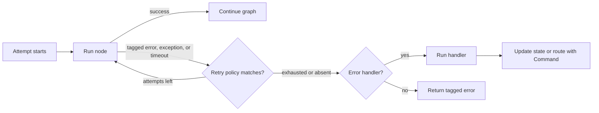

# Fault Tolerance

Fault tolerance is the set of controls you use when a graph node fails because
an API is slow, a provider returns a transient error, a node raises, or a
parallel branch needs recovery.

BeamWeaver gives you composable node and graph controls:

- **Retries** rerun a failed node attempt according to `BeamWeaver.RetryPolicy`.
- **Timeouts** bound node attempts, super-steps, and whole graph invocations.
- **Error handlers** recover after retries are exhausted.
- **Graph defaults** apply shared retry, timeout, cache, or error-handler options
  to nodes added after the defaults are set.
- **Failure policy** controls whether a parallel super-step stops immediately or
  waits for siblings before halting.


**BeamWeaver Shape**

LangGraph documents Python `retry_policy=`, `timeout=`, `error_handler=`,
`NodeError`, `NodeTimeoutError`, async-only timeout behavior, and Functional API
decorators. BeamWeaver exposes the same fault-tolerance ideas through Elixir
node options: `retry:`, `timeout:`, `error_handler:`,
`BeamWeaver.Graph.set_node_defaults/2`, `failure_policy:`, and tagged
`%BeamWeaver.Core.Error{}` values.




Retries run first. Error handlers run only after retry exhaustion. Interrupts
are not errors and bypass both retry and error-handler flow.

## Retries

Pass `retry:` to `BeamWeaver.Graph.add_node/4`:

```elixir
alias BeamWeaver.Graph
alias BeamWeaver.Graph.Compiled
alias BeamWeaver.RetryPolicy

graph =
  Graph.new(name: "RetryExample")
  |> Graph.add_node(
    :call_api,
    fn state ->
      MyApp.API.fetch!(state.id)
    end,
    retry: RetryPolicy.new!(
      max_attempts: 3,
      initial_delay: 100,
      backoff: 2.0,
      max_delay: 2_000,
      retry_on: :transient
    )
  )
  |> Graph.add_edge(Graph.start(), :call_api)
  |> Graph.add_edge(:call_api, Graph.end_node())
  |> Graph.compile!()

Compiled.invoke(graph, %{id: "acct_123"})
```

You can also pass an integer shorthand:

```elixir
Graph.add_node(graph, :call_api, call_api, retry: 2)
```

The integer form means "retry two times after the first attempt", for three
total attempts.

## Retry Policy Parameters

`BeamWeaver.RetryPolicy` uses milliseconds for integer durations. Floats are
accepted as seconds for LangGraph-style interop.

| Option | Default | Meaning |
| --- | --- | --- |
| `:max_attempts` | `3` | Maximum attempts, including the first attempt. |
| `:initial_delay` | `0` | Delay before the first retry. |
| `:backoff` | `2.0` | Multiplier applied to each retry delay. |
| `:max_delay` | `5_000` | Maximum retry delay in milliseconds. |
| `:jitter` | `false` | Add random jitter. `true` jitters by the current delay; an integer jitters by that many milliseconds. |
| `:retry_on` | `:error` | Which errors are retryable. |
| `:timeout` | `nil` | Reserved policy metadata for shared retry use; node attempt timeout is configured with `timeout:`. |

Useful `retry_on` values:

- `:error`: retry any `%BeamWeaver.Core.Error{}`.
- `:all`: retry any error term passed to the policy.
- `:transient`: retry known transient BeamWeaver errors, HTTP statuses, and
  transport messages.
- an error type atom such as `:rate_limit` or `:node_timeout`
- a list of error type atoms
- a one-argument predicate function
- an MFA tuple `{Module, :function, extra_args}`

```elixir
retry =
  RetryPolicy.new!(
    max_attempts: 4,
    initial_delay: 250,
    max_delay: 4_000,
    jitter: true,
    retry_on: fn
      %BeamWeaver.Core.Error{type: :permanent_validation_error} -> false
      error -> BeamWeaver.RetryPredicates.transient?(error)
    end
  )
```


**Retry Predicate Deviation**

LangGraph's Python default excludes specific exception classes such as
`ValueError`, `TypeError`, and `RuntimeError`, then has library-specific HTTP
rules. BeamWeaver does not expose Python exception classes. Node exceptions are
normalized to `%BeamWeaver.Core.Error{type: :node_exception}`. Use
`:transient`, explicit error type atoms, or a predicate when you do not want to
retry every tagged error.


## Inspect Retry State

Graph nodes can accept runtime as a second argument. `runtime.execution` exposes
attempt metadata:

```elixir
call_api = fn state, runtime ->
  if runtime.execution.node_attempt > 1 do
    %{result: MyApp.API.fallback_fetch!(state.id)}
  else
    %{result: MyApp.API.primary_fetch!(state.id)}
  end
end

graph =
  Graph.new()
  |> Graph.add_node(:call_api, call_api,
    retry: RetryPolicy.new!(max_attempts: 3, retry_on: :transient)
  )
```

Common execution fields:

| Field | Meaning |
| --- | --- |
| `node_attempt` | Attempt number, starting at `1`. |
| `node_first_attempt_time` | Millisecond timestamp for the first attempt. |
| `thread_id` | Current checkpoint thread ID, when configured. |
| `run_id` | Current graph run ID. |
| `checkpoint_id` | Checkpoint ID from the execution config. |
| `checkpoint_ns` | Checkpoint namespace for subgraph execution. |
| `task_id` | Current graph task ID. |

## Timeouts

Pass `timeout:` to `BeamWeaver.Graph.add_node/4` to bound a single node attempt:

```elixir
Graph.add_node(graph, :call_model, call_model, timeout: 60_000)
```

A float is interpreted as seconds:

```elixir
Graph.add_node(graph, :call_model, call_model, timeout: 0.5)
```

Use `BeamWeaver.TimeoutPolicy` when you want to express separate budgets:

```elixir
alias BeamWeaver.TimeoutPolicy

Graph.add_node(graph, :call_model, call_model,
  timeout: TimeoutPolicy.new!(run_timeout: 120_000, idle_timeout: 30_000)
)
```

BeamWeaver currently executes graph nodes as supervised BEAM tasks. The
effective node timeout is a hard task timeout. When `run_timeout` and
`idle_timeout` are both set in `TimeoutPolicy`, BeamWeaver uses the earliest
budget as the effective task timeout.

Agent model calls are also graph nodes. For model/tool agents, BeamWeaver sets
the generated `"model"` node timeout from `model_opts[:timeout]` first, then
from `model.timeout` when the model struct exposes one. If neither is present,
the normal graph node default of `5_000` milliseconds applies. Configure long
model calls with `BeamWeaver.Agent.build(model_opts: [timeout: ...])`, the
`model/2` DSL, or a provider model constructed with `timeout: ...`.


**Idle Timeout Deviation**

LangGraph's Python runtime has progress-resetting idle timeouts and
`runtime.heartbeat()`. BeamWeaver accepts `TimeoutPolicy` data for serialization,
but it does not currently expose a graph-node heartbeat API
or progress-resetting idle clock. Use node boundaries, streaming events, and
application-level progress tracking when you need richer liveness behavior.


## Timeout Errors

When a node attempt exceeds its timeout, BeamWeaver returns a tagged error:

```elixir
alias BeamWeaver.Graph.Compiled

{:error,
 %BeamWeaver.Core.Error{
   type: :node_timeout,
   message: "node timed out",
   details: %{
     node: "call_model",
     timeout: 10_000,
     node_timeout: 10_000,
     step_timeout: :infinity,
     run_timeout: :infinity
   }
 }} = Compiled.invoke(graph, input)
```

`timeout:` composes with `retry:`. To retry timed-out attempts explicitly:

```elixir
Graph.add_node(graph, :call_model, call_model,
  timeout: 10_000,
  retry: RetryPolicy.new!(max_attempts: 3, retry_on: :node_timeout)
)
```

Using `BeamWeaver.RetryPolicy.new!()` without a custom `retry_on` also retries
`:node_timeout`, because the default `retry_on: :error` matches any
`%BeamWeaver.Core.Error{}`.

## Graph Error Telemetry

Graph execution emits native telemetry for task failures and budget stops:

| Event | Meaning |
| --- | --- |
| `[:beam_weaver, :graph, :node_exit]` | A node task exited, threw, or was killed before returning. |
| `[:beam_weaver, :graph, :node_timeout]` | A node attempt exceeded its timeout. |
| `[:beam_weaver, :graph, :node_failure]` | A node returned another tagged error. |
| `[:beam_weaver, :graph, :node_cancel]` | A running node task was cancelled by a hard graph budget. |
| `[:beam_weaver, :graph, :step_timeout]` | A graph super-step exceeded `step_timeout`. |

`%BeamWeaver.Core.Error{type: :node_exit}` details include the original BEAM
`root_cause` term when available, plus an inspected string reason for logging.
Telemetry metadata includes the graph, node, step, and normalized error. Attach
handlers to these events when you need operational alerts; use WeaveScope
tracing for product-facing run trees.

## Dynamic Send Timeouts

Dynamic fan-out can override the target node timeout for one send:

```elixir
alias BeamWeaver.Graph.Send
alias BeamWeaver.TimeoutPolicy

fan_out = fn state ->
  Enum.map(state.items, fn item ->
    %Send{
      node: :process_item,
      update: %{item: item},
      timeout: TimeoutPolicy.new!(run_timeout: 15_000)
    }
  end)
end
```

If `timeout:` is omitted on the send, the target node's static timeout applies.

## Step And Run Timeouts

Node timeouts cap one node attempt. Graph-level budgets cap larger execution
units:

```elixir
alias BeamWeaver.Graph
alias BeamWeaver.Graph.Compiled

graph =
  workflow
  |> Graph.compile!(
    step_timeout: 60_000,
    run_timeout: 300_000
  )

Compiled.invoke(graph, input, recursion_limit: 50)
```

| Option | Scope |
| --- | --- |
| `timeout:` on `add_node` | One node attempt. |
| `timeout:` on `%BeamWeaver.Graph.Send{}` | One dynamic task push. |
| `step_timeout:` on `BeamWeaver.Graph.compile!/2` | One graph super-step. |
| `run_timeout:` on `BeamWeaver.Graph.compile!/2` | One graph invocation. |
| `recursion_limit:` on `BeamWeaver.Graph.Compiled.invoke/3` | Maximum executed super-steps. |

Hard budgets such as `step_timeout` and `run_timeout` stop the run even when
`failure_policy: :proceed` is configured.

## Error Handling

An error handler runs after a node fails and retries are exhausted. Use it to
recover, compensate, or route to a fallback node.

```elixir
alias BeamWeaver.Core.Error
alias BeamWeaver.Graph
alias BeamWeaver.Graph.Command
alias BeamWeaver.RetryPolicy

charge_payment = fn _state ->
  {:error, Error.new(:payment_gateway_timeout, "payment gateway timed out")}
end

payment_error_handler = fn error, state, runtime ->
  %Command{
    update: %{
      status: "compensated",
      failed_node: runtime.node,
      error_type: error.type,
      order_id: state.order_id
    },
    goto: :finalize
  }
end

graph =
  Graph.new(name: "PaymentFlow")
  |> Graph.add_node(:charge_payment, charge_payment,
    retry: RetryPolicy.new!(max_attempts: 3, retry_on: :transient),
    error_handler: payment_error_handler
  )
  |> Graph.add_node(:finalize, fn state -> %{final_status: state.status} end)
  |> Graph.add_edge(Graph.start(), :charge_payment)
  |> Graph.add_edge(:finalize, Graph.end_node())
  |> Graph.compile!()
```

Handlers may return a state update map or a `%BeamWeaver.Graph.Command{}`. A
command lets the handler update state and route to a specific recovery node.

## Error Handler Signatures

BeamWeaver handlers receive `%BeamWeaver.Core.Error{}` values, not Python
`NodeError` objects.

Supported handler shapes:

```elixir
fn error ->
  %{error_type: error.type}
end

fn error, %{state: state, runtime: runtime} ->
  %{error_type: error.type, input: state.input, node: runtime.node}
end

fn error, state, runtime ->
  %{error_type: error.type, input: state.input, node: runtime.node}
end
```

The arity-three form is the most explicit and is usually the clearest for
application code.


**Resume-Safe Handlers**

With a checkpointer, error-handler provenance is checkpointed. If a process
crashes or the handler fails after the original node failed, the graph can
resume the handler without rerunning the failed node. Handler failures are not
automatically retried by the node retry policy; make handler side effects
idempotent or add retry logic inside the handler when needed.


## Handler Failures

If an error handler raises, BeamWeaver returns
`%BeamWeaver.Core.Error{type: :node_error_handler_failed}`. The original error
is stored in `error.details[:handled_error]` when available.

```elixir
Graph.add_node(graph, :bad_handler, failing_node,
  error_handler: fn _error ->
    raise "handler exploded"
  end
)
```

Do not put irreversible compensation writes in a handler unless those writes are
idempotent.

## Interrupts

`BeamWeaver.Graph.interrupt/1` is not routed through retry or error handling.
It pauses the graph for human-in-the-loop workflows and returns
`{:interrupted, interrupt}` from `BeamWeaver.Graph.Compiled.invoke/3` or
`BeamWeaver.Graph.Compiled.stream_events/3`.

Resume it with `BeamWeaver.Graph.Compiled.resume/3` using the same `thread_id`.

## Subgraph Failures

If a node wraps a compiled subgraph and that subgraph returns an unhandled
error, the error surfaces to the parent node. A parent node `error_handler:` can
recover from that subgraph error.

```elixir
Graph.add_node(parent, :child_graph, child_graph,
  error_handler: fn error, _state, runtime ->
    %{recovered_by: runtime.node, subgraph_error: error.type}
  end
)
```

## Graph Defaults

Use `BeamWeaver.Graph.set_node_defaults/2` to avoid repeating the same options for many
nodes:

```elixir
alias BeamWeaver.Graph
alias BeamWeaver.RetryPolicy

default_retry =
  RetryPolicy.new!(max_attempts: 3, retry_on: :transient, initial_delay: 100)

default_handler = fn error, _state, runtime ->
  %{handled_by: :default, node: runtime.node, error_type: error.type}
end

graph =
  Graph.new(name: "DefaultedGraph")
  |> Graph.set_node_defaults(retry: default_retry)
  |> Graph.set_node_defaults(timeout: 30_000, error_handler: default_handler)
  |> Graph.add_node(:step_a, step_a)
  |> Graph.add_node(:step_b, step_b, timeout: 5_000)
```

Per-node options override defaults.


**Defaults Are Not Retroactive**

LangGraph documents `set_node_defaults()` as compile-time defaults that can be
called before or after `add_node()`. BeamWeaver merges defaults into node options
when `BeamWeaver.Graph.add_node/4` is called. Call
`BeamWeaver.Graph.set_node_defaults/2` before the nodes you want to affect.
Existing nodes are not rewritten.


Defaults are scoped to the graph builder where they are set. They are not
inherited by compiled subgraphs.

## Parallel Failure Policy

`failure_policy:` controls how a super-step behaves when one task fails while
siblings are still running:

```elixir
graph =
  workflow
  |> Graph.compile!(
    checkpointer: checkpointer,
    failure_policy: :proceed
  )
```

| Policy | Behavior |
| --- | --- |
| `:panic` | Stop after the first non-budget failure. This is the default. |
| `:proceed` | Let sibling tasks finish, persist successful writes and failures, then halt. |

Use `:proceed` with a checkpointer when you want pending writes from successful
siblings to be available for resume. Timeouts and other hard budgets still stop
the run.

## Functional API

LangGraph's Python Functional API supports `timeout=` and `retry_policy=` on
`@task` and `@entrypoint`. BeamWeaver does not expose `@task` or `@entrypoint`.

Use ordinary Elixir functions for local control flow. Use `BeamWeaver.Graph`
when you need durable state, retries, timeouts, error handlers, streaming,
interrupts, or checkpoint history.

## Related Guides

- [Durable Execution](durable_execution.md)
- [Persistence](persistence.md)
- [Thinking In BeamWeaver](thinking_in_beamweaver.md)
- [Workflows And Agents](workflows_and_agents.md)
- [Graph](graph.md)
- [Runtime](runtime.md)
- [Event Streaming](event_streaming.md)
- [Human-In-The-Loop](human_in_the_loop.md)
