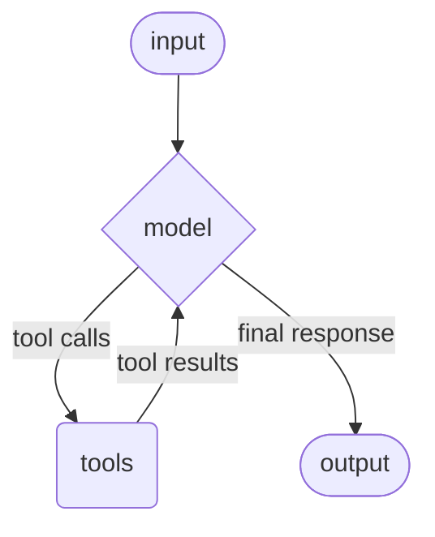
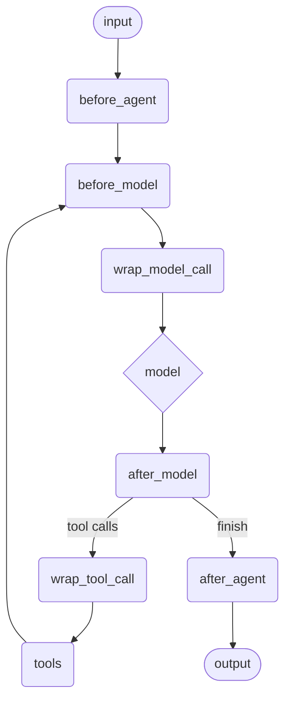

# Middleware

Middleware controls and customizes agent execution at the boundaries where an
agent prepares state, calls a model, handles model output, executes tools, and
finishes a run. Use middleware for logging, dynamic prompts, tool selection,
retries, fallbacks, rate and call limits, context editing, PII handling,
summarization, human review, and policy checks.

This page explains the lifecycle and execution model. Use
[Prebuilt Middleware](prebuilt_middleware.md) for the module catalog and
[Custom Middleware](custom_middleware.md) when you are implementing your own
middleware.

Add middleware to module-defined agents with a `middleware do` block:

```elixir
defmodule MyApp.SupportAgent do
  use BeamWeaver.Agent

  alias BeamWeaver.Agent.Middleware

  model BeamWeaver.Models.init_chat_model!("openai:gpt-5.4-mini")

  tools do
    tool MyApp.Tools.SearchDocs
  end

  middleware do
    use Middleware.DynamicPrompt, prompt: &__MODULE__.system_prompt/1
    use Middleware.ModelRetry, max_retries: 2, initial_delay: 25, retry_on: :transient
    use Middleware.ToolSelection, deny: ["internal_admin_tool"]
  end

  def system_prompt(request) do
    user_tier = get_in(request.runtime.context || %{}, [:user_tier]) || "standard"
    "You are a support agent for a #{user_tier} customer."
  end
end
```

Runtime-built agents use the same option:

```elixir
{:ok, agent} =
  BeamWeaver.Agent.build(
    model: BeamWeaver.Models.init_chat_model!("openai:gpt-5.4-mini"),
    tools: [MyApp.Tools.SearchDocs],
    middleware: [
      {BeamWeaver.Agent.Middleware.ModelFallback,
       fallbacks: [BeamWeaver.Models.init_chat_model!("anthropic:claude-haiku-4-5")]}
    ]
  )
```


**Elixir Middleware Shape**

LangChain's Python middleware examples use decorators and classes passed to
`create_agent`. BeamWeaver middleware is ordinary Elixir data: a module, a
struct, or `{module, opts}`. If a middleware module exposes `new/1`, BeamWeaver
uses it for `{module, opts}` entries; otherwise it can build a struct from the
options or use the module directly.


## The Agent Loop

The core agent loop calls a model, executes any requested tools, then loops back
to the model until the model no longer requests tools.



Middleware hooks run around that loop:



The actual graph only contains middleware nodes for hooks that a middleware
implements. Tool execution nodes are present when tools exist or when middleware
requires the tool node.

## Hooks

Implement `BeamWeaver.Agent.Middleware` and define only the callbacks you need.

| Hook | Runs |
| --- | --- |
| `before_agent/2` or `before_agent/3` | Before the first model step. |
| `before_model/2` or `before_model/3` | Before every model call. |
| `wrap_model_call/2` or `wrap_model_call/3` | Around each model request. |
| `after_model/2` or `after_model/3` | After every model response. |
| `wrap_tool_call/2` or `wrap_tool_call/3` | Around each tool execution. |
| `after_agent/2` or `after_agent/3` | After the agent is ready to finish. |

Use the three-argument form when the middleware has struct state:

```elixir
defmodule MyApp.LoggingMiddleware do
  @behaviour BeamWeaver.Agent.Middleware

  require Logger

  defstruct [:label]

  def new(opts), do: %__MODULE__{label: Keyword.get(opts, :label, "agent")}
  def name(_middleware), do: :logging

  def wrap_model_call(%__MODULE__{label: label}, request, handler) do
    Logger.info("#{label}: model call with #{length(request.messages)} messages")

    case handler.(request) do
      {:ok, _response} = result ->
        Logger.info("#{label}: model response accepted")
        result

      {:error, error} = result ->
        Logger.warning("#{label}: model error #{inspect(error.type)}")
        result
    end
  end
end
```

Use the two-argument form for stateless module middleware:

```elixir
defmodule MyApp.TrimMessages do
  @behaviour BeamWeaver.Agent.Middleware

  alias BeamWeaver.Graph.Overwrite

  def name(_middleware), do: :trim_messages

  def before_model(state, _runtime) do
    messages = Map.get(state, :messages, [])

    if length(messages) > 12 do
      %{messages: Overwrite.new(Enum.take(messages, -12))}
    else
      %{}
    end
  end
end
```


**Decorators And Hook Functions**

Python LangChain exposes decorators such as `@before_model`,
`@after_model`, `@wrap_model_call`, and `@wrap_tool_call`. BeamWeaver does not
use decorators. The lifecycle point is the callback name on an Elixir module or
struct. This keeps middleware discoverable at compile time and keeps runtime
configuration as ordinary Elixir data.


## Return Values

State hooks can return:

- `nil` or `%{}` for no change
- a map of state updates
- `{:ok, map}` for explicit success
- `{:error, %BeamWeaver.Core.Error{}}` or another error term
- `{:jump, :model | :tools | :end, map}` for routing plus state updates
- `%BeamWeaver.Graph.Command{}` for explicit graph commands

Wrappers receive an immutable request and a handler function. Modify the
request with `BeamWeaver.Agent.ModelRequest.override/2` or
`BeamWeaver.Agent.ToolCallRequest.override/2`, then call the handler.

```elixir
defmodule MyApp.SwitchModel do
  @behaviour BeamWeaver.Agent.Middleware

  alias BeamWeaver.Agent.ModelRequest

  def name(_middleware), do: :switch_model

  def wrap_model_call(request, handler) do
    model =
      if Map.get(request.runtime.context || %{}, :premium?) do
        BeamWeaver.Models.init_chat_model!("openai:gpt-5.4")
      else
        request.model
      end

    request
    |> ModelRequest.override(model: model)
    |> handler.()
  end
end
```

## State And Context

Middleware can declare the state and context it expects:

```elixir
defmodule MyApp.PreferenceMiddleware do
  @behaviour BeamWeaver.Agent.Middleware

  def name(_middleware), do: :preferences

  def state_schema(_middleware) do
    %{
      preferences: BeamWeaver.Graph.channel(BeamWeaver.Graph.Channels.LastValue)
    }
  end

  def context_schema(_middleware) do
    %{
      user_id: BeamWeaver.Agent.Schema.field(:user_id, :string, required: true)
    }
  end

  def before_model(state, runtime) do
    user_id = runtime.context.user_id
    preferences = Map.get(state, :preferences, %{})

    %{preferences: Map.put_new(preferences, :user_id, user_id)}
  end
end
```


**State Ownership**

Python LangChain documents both middleware-owned state and direct
`state_schema` configuration on agents. BeamWeaver supports graph schemas, but
agent middleware should usually declare the state it owns. This keeps state
channels, hooks, and tools in the same module.


## Built-In Middleware

BeamWeaver includes middleware for common agent policies:

| Middleware | Purpose |
| --- | --- |
| `DynamicPrompt` | Compute or replace the system prompt before model calls. |
| `ToolSelection` | Add, filter, deny, or model-select tools per request. |
| `ModelRetry` | Retry failed model calls with `BeamWeaver.RetryPolicy`. |
| `ModelFallback` | Try alternate models when the primary model fails. |
| `ToolRetry` | Retry selected tool calls. |
| `ModelCallLimit` | Limit model calls per run or thread. |
| `ToolCallLimit` | Limit tool calls globally or per tool. |
| `Summarization` | Summarize long message histories before model calls. |
| `StructuredOutputRetry` | Retry model calls after structured-output failures. |
| `HumanInTheLoop` | Interrupt before configured tool calls for review. |
| `ContextEditing` | Edit or clear context before model calls. |
| `PII` | Detect, redact, mask, hash, or block common PII. |
| `TodoList` | Add a TODO planning tool and policy prompt. |
| `ShellTool` | Add policy-governed shell command tools. |
| `ToolEmulator` | Emulate tool results without local execution. |

See [Custom Middleware](custom_middleware.md) for implementing your own hooks.
See [Prebuilt Middleware](prebuilt_middleware.md) for per-middleware examples,
configuration options, and notes on Python differences such as file search,
filesystem tools, provider middleware, subagents, and guardrails.

```elixir
middleware do
  use BeamWeaver.Agent.Middleware.Summarization,
   model: BeamWeaver.Models.init_chat_model!("openai:gpt-5.4-mini"),
   trigger: {:all, [{:messages, 30}, {:tokens, 8_000}]},
   keep: {:messages, 10}

  use BeamWeaver.Agent.Middleware.PII,
   detectors: [:email, :credit_card],
   strategy: :redact,
   apply_to_input: true,
   apply_to_output: true
end
```

Summarization trigger lists are OR by default. Use `{:all, triggers}` when a run
should satisfy every condition before summarizing, and `{:any, triggers}` when
the intent should be explicit in configuration.

`HumanInTheLoop` review configs can include a `:when` or `:predicate` function
with arity 1, 2, or 3 to gate review per emitted tool call. Set
`interrupt_mode: :first` when only the first matching call should pause the run.

For streamed output redaction, use
`BeamWeaver.Agent.Middleware.PII.stream_transform/1` with
`BeamWeaver.Stream.MessagesTransformer.new(pre_projection: ...)` so text is
edited before message projection.


**Provider Middleware Integrations**

LangChain's Python docs link to provider-specific middleware integrations.
BeamWeaver does not currently expose a separate provider middleware integration
catalog. Provider-specific behavior lives in provider adapters, model options,
tools, and ordinary BeamWeaver middleware modules.


## Middleware Inside Graphs

Middleware is not a separate runtime. `use BeamWeaver.Agent` compiles middleware
hooks into the agent's `BeamWeaver.Graph`. That means the whole agent, including
its middleware, can be used as a compiled subgraph in a larger graph.

```elixir
{:ok, email_agent} = BeamWeaver.Agent.compiled_graph(MyApp.EmailAgent)

graph =
  BeamWeaver.Graph.new(name: "EmailWorkflow")
  |> BeamWeaver.Graph.add_node(:classify, fn state ->
    %{route: if(String.contains?(state.subject, "urgent"), do: :email, else: :end)}
  end)
  |> BeamWeaver.Graph.add_node(:email_agent, email_agent)
  |> BeamWeaver.Graph.add_edge(BeamWeaver.Graph.start(), :classify)
  |> BeamWeaver.Graph.add_edge(:classify, :email_agent, when: %{route: :email})
  |> BeamWeaver.Graph.add_edge(:classify, BeamWeaver.Graph.end_node(), default: true)
  |> BeamWeaver.Graph.add_edge(:email_agent, BeamWeaver.Graph.end_node())
  |> BeamWeaver.Graph.compile!()
```

Human review, summarization, PII handling, retries, fallbacks, and custom hooks
travel with the compiled agent subgraph. Use [Event Streaming](event_streaming.md)
to observe the resulting middleware, model, tool, and subgraph events.


**Hosted Platform Scope**

The Python page discusses LangGraph workflows and hosted platform composition.
BeamWeaver supports local graph and subgraph composition with
`BeamWeaver.Graph`; it does not mirror LangGraph Platform SDK, server, or CLI
APIs. Use normal OTP supervision and release tooling for deployed services.



**Testing And Tracing**

The Python middleware overview links to hosted agent testing. BeamWeaver's
testing path is ordinary ExUnit tests around your agents, tools, and
middleware. Use fake or replay transports for deterministic provider behavior
and `BeamWeaver.Tracing` for telemetry/export boundaries; there is no
BeamWeaver-specific hosted agent test runner.


## Related Guides

- [Agents](agents.md)
- [Context Engineering](context_engineering.md)
- [Tools](tools.md)
- [Custom Middleware](custom_middleware.md)
- [Prebuilt Middleware](prebuilt_middleware.md)
- [Guardrails](guardrails.md)
- [Runtime](runtime.md)
- [Short-Term Memory](short_term_memory.md)
- [Structured Output](structured_output.md)
- [Event Streaming](event_streaming.md)
- [Graph](graph.md)
