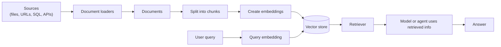
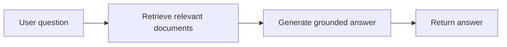
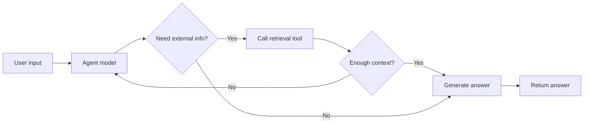

# Retrieval

Large language models are useful reasoning engines, but they have two practical
limits:

- finite context windows, so they cannot ingest an entire corpus for every
  request
- static training data, so they do not automatically know your latest internal
  documents, tickets, product state, or database records

Retrieval solves this by fetching relevant external knowledge at query time.
Retrieval-Augmented Generation (RAG) then gives that retrieved context to a
model or an agent so answers can be grounded in application data.


**BeamWeaver Shape**

LangChain's Python retrieval page points to broad integration catalogs for
document loaders, embeddings, vector stores, and retrievers. BeamWeaver exposes
the same core concepts as explicit Elixir behaviours and adapters, but it does
not claim the Python integration catalog. Current native pieces include
`BeamWeaver.DocumentLoader`, `BeamWeaver.TextSplitter`,
`BeamWeaver.Core.EmbeddingModel`, `BeamWeaver.VectorStore`,
`BeamWeaver.Retriever`, and `BeamWeaver.DocumentIndex`.


## Building A Knowledge Base

A knowledge base is a repository of documents or structured data used during
retrieval. In BeamWeaver, a custom knowledge base usually combines:

1. a document loader
2. an optional splitter
3. optional document transformers
4. an embedding model
5. a vector store
6. an optional record manager for incremental indexing

If you already have a knowledge base, such as SQL, CRM, search, or internal
documentation infrastructure, you do not need to rebuild it. Expose it as a
tool for agentic RAG, or query it directly and place the result in the model
context for 2-step RAG.



## Building Blocks

| Block | BeamWeaver surface | Purpose |
| --- | --- | --- |
| Documents | `BeamWeaver.Core.Document` | Text plus metadata used by loaders, splitters, retrievers, and vector stores. |
| Document loaders | `BeamWeaver.DocumentLoader` | Load text from strings, paths, URLs, or blobs into document streams. |
| Text splitters | `BeamWeaver.TextSplitter` | Split large documents into chunks that can be retrieved and fit model context. |
| Embedding models | `BeamWeaver.Core.EmbeddingModel` | Turn document text and queries into vectors. |
| Vector stores | `BeamWeaver.VectorStore` | Store embeddings and search similar documents. |
| Retrievers | `BeamWeaver.Retriever` | Return relevant documents for an unstructured query. |
| Indexing | `BeamWeaver.DocumentIndex` and `BeamWeaver.Indexing` | Orchestrate loading, splitting, transforming, embedding, and record tracking. |


**Integration Scope**

BeamWeaver currently ships native local/test and Postgres-backed retrieval
adapters, including `BeamWeaver.VectorStore.ETS`,
`BeamWeaver.VectorStore.EctoPostgres`, and indexing record managers. It does
not ship first-class Google Drive, Slack, Notion, Pinecone, Weaviate, or other
LangChain Python integrations unless you add an adapter that implements the
BeamWeaver behaviour.


## Index Documents

`BeamWeaver.DocumentIndex` is the high-level indexing orchestration struct. You
provide each moving part explicitly:

```elixir
alias BeamWeaver.DocumentIndex
alias BeamWeaver.DocumentLoader
alias BeamWeaver.DocumentTransformer
alias BeamWeaver.Indexing.RecordManager
alias BeamWeaver.Models.FakeEmbeddingModel
alias BeamWeaver.TextSplitter
alias BeamWeaver.VectorStore.ETS, as: VectorETS

vector_store = VectorETS.new(embedding: %FakeEmbeddingModel{})
records = RecordManager.ETS.new(namespace: :docs)

index =
  DocumentIndex.new(
    loader: DocumentLoader.paths(["docs/getting_started.md", "docs/agents.md"]),
    splitter: TextSplitter.recursive_character(chunk_size: 800, chunk_overlap: 120),
    transformers: [
      DocumentTransformer.metadata_map(&Map.put(&1, :tenant, "demo"))
    ],
    vector_store: vector_store,
    record_manager: records,
    namespace: :docs
  )

{:ok, %{added: added, updated: updated, skipped: skipped}} = DocumentIndex.run(index)
```

For a minimal in-memory example, use a text loader:

```elixir
alias BeamWeaver.DocumentIndex
alias BeamWeaver.DocumentLoader
alias BeamWeaver.Models.FakeEmbeddingModel
alias BeamWeaver.VectorStore.ETS, as: VectorETS

store = VectorETS.new(embedding: %FakeEmbeddingModel{})

index =
  DocumentIndex.new(
    loader: DocumentLoader.text("BeamWeaver uses explicit retrievers."),
    vector_store: store
  )

{:ok, %{added: 1}} = DocumentIndex.run(index)
```


**Fake Embeddings Are For Tests**

The fake embedding model used in these snippets is deterministic and useful for
docs, examples, and tests. Use a provider embedding adapter such as
`BeamWeaver.OpenAI.EmbeddingModel` for production semantic search, and keep
embedding dimensions aligned with your vector store schema.


## URL Retrieval Policy

URL-based loaders validate targets through `BeamWeaver.Transport.URLPolicy`
before calling a transport. The default policy is conservative: HTTPS only, no
userinfo, no localhost, no Docker or Kubernetes internal hostnames, no cloud
metadata endpoints, and no private or reserved IP literals.

```elixir
policy =
  BeamWeaver.Transport.URLPolicy.new(
    schemes: ["https"],
    resolve?: true,
    resolver: fn host, port -> {:ok, MyResolver.lookup(host, port)} end
  )

{:ok, url} =
  BeamWeaver.Transport.URLPolicy.validate("https://example.com/handbook", policy)
```

`allowed_hosts` is an explicit bypass for trusted internal names. Private
RFC1918 addresses require `allow_private?: true`; loopback and cloud metadata
endpoints have separate opt-ins so test-only local access does not accidentally
allow metadata access in production.

## Text Splitter Streams

Text splitters support list and stream-friendly APIs. Use `split_text/2` when a
single string is already in memory, `split_documents/2` when preserving
document metadata, and `stream_text/2` when chaining an enumerable of raw texts:

```elixir
splitter = BeamWeaver.TextSplitter.character(separator: " ", chunk_size: 500)

{:ok, chunks} =
  BeamWeaver.TextSplitter.stream_text(splitter, Stream.map(paths, &File.read!/1))
```

## RAG Architectures

RAG can be implemented several ways depending on how much control and latency
predictability you need.

| Architecture | Description | Control | Flexibility | Latency |
| --- | --- | --- | --- | --- |
| 2-step RAG | Retrieve before generation every time. | High | Low | Predictable |
| Agentic RAG | The model decides when and how to retrieve through tools. | Lower | High | Variable |
| Hybrid RAG | Adds preprocessing, validation, self-correction, or graph steps around retrieval. | Medium | Medium | Variable |


**Latency**

2-step RAG usually has predictable latency because the number of model calls is
fixed. Retrieval latency can still vary with database performance, network
calls, embedding providers, and result size. Agentic and hybrid RAG may call
tools and models multiple times.


## 2-Step RAG

In 2-step RAG, retrieval always happens before generation:



BeamWeaver keeps this as ordinary Elixir code. Retrieve documents, format them,
and pass them into the model:

```elixir
alias BeamWeaver.Core.{ChatModel, Message}
alias BeamWeaver.Retriever

defmodule MyApp.RAG do
  def answer(model, retriever, question) do
    with {:ok, docs} <- Retriever.retrieve(retriever, question, k: 4) do
      context =
        docs
        |> Enum.map_join("\n\n---\n\n", fn doc ->
          source = doc.metadata[:source] || doc.metadata["source"] || "unknown"
          "Source: #{source}\n#{doc.content}"
        end)

      ChatModel.invoke(model, [
        Message.system("""
        Answer using only the supplied context. If the context is insufficient,
        say what is missing.
        """),
        Message.user("Question: #{question}\n\nContext:\n#{context}")
      ])
    end
  end
end
```

Build a retriever from a vector store:

```elixir
alias BeamWeaver.Retriever
alias BeamWeaver.VectorStore

retriever = VectorStore.as_retriever(vector_store, k: 4, search_type: :similarity)

{:ok, docs} = Retriever.retrieve(retriever, "How do agents use tools?")
```

## Agentic RAG

Agentic RAG gives the model a retrieval tool and lets it decide when to search.
This is useful when the agent may need to ask multiple questions, choose between
data sources, or combine retrieval with other actions.



Any retriever can become a BeamWeaver tool:

```elixir
alias BeamWeaver.Agent
alias BeamWeaver.Core.Message
alias BeamWeaver.Retriever
alias BeamWeaver.VectorStore

retriever = VectorStore.as_retriever(vector_store, k: 4)

knowledge_search =
  Retriever.as_tool(retriever,
    name: "knowledge_search",
    description: "Search the product documentation for relevant passages.",
    response_format: :content_and_artifact
  )

{:ok, agent} =
  Agent.build(
    name: "agentic_rag",
    model: BeamWeaver.Models.init_chat_model!("openai:gpt-5.4"),
    tools: [knowledge_search],
    system_prompt: """
    Use knowledge_search when you need product documentation. Quote source
    details from retrieved documents when they are available.
    """
  )

Agent.invoke(agent, %{
  messages: [Message.user("How should I configure human review for SQL tools?")]
})
```


**No Python Tool Decorator**

LangChain's example uses Python `@tool`, `requests`, and `markdownify`.
BeamWeaver tools are `BeamWeaver.Core.Tool` structs or `use BeamWeaver.Tool`
modules. For network retrieval, put URL validation and transport policy in the
tool handler, or index approved URLs ahead of time with `DocumentLoader.urls/2`.


## Hybrid RAG

Hybrid RAG combines fixed retrieval with agentic or graph-controlled validation.
Common steps include:

- query enhancement before retrieval
- multiple retrieval attempts with revised queries
- relevance checks before generation
- answer validation against retrieved sources
- fallback answers when retrieval is insufficient

Use `BeamWeaver.Graph` when the workflow has deterministic control flow:

```elixir
alias BeamWeaver.Graph
alias BeamWeaver.Graph.Command

graph =
  Graph.new(name: "HybridRAG")
  |> Graph.add_node(:rewrite_query, &MyApp.RAG.rewrite_query/1)
  |> Graph.add_node(:retrieve, &MyApp.RAG.retrieve/1)
  |> Graph.add_node(:validate_context, fn state ->
    if MyApp.RAG.enough_context?(state) do
      %Command{goto: :generate}
    else
      %Command{goto: :rewrite_query}
    end
  end)
  |> Graph.add_node(:generate, &MyApp.RAG.generate/1)
  |> Graph.add_edge(Graph.start(), :rewrite_query)
  |> Graph.add_edge(:rewrite_query, :retrieve)
  |> Graph.add_edge(:retrieve, :validate_context)
  |> Graph.add_edge(:generate, Graph.end_node())
  |> Graph.compile!()
```

Use middleware when the validation is cross-cutting, such as logging, context
editing, PII detection, model retries, or final output checks.


**Graph Names, Not LangGraph Tutorials**

The LangChain page links to LangGraph's Python agentic RAG tutorials. In
BeamWeaver, implement equivalent workflows with `BeamWeaver.Graph`,
`BeamWeaver.Agent`, tools, and middleware. There is no Python `create_agent`
runtime or LangGraph Platform dependency in the BeamWeaver API.


## Related Guides

- [Agents](agents.md)
- [Tools](tools.md)
- [Models](models.md)
- [Context Engineering](context_engineering.md)
- [Long-Term Memory](long_term_memory.md)
- [Event Streaming](event_streaming.md)
- [Graph](graph.md)
- [Adapters](adapters.md)
- [OpenAI](partners/openai.md)
