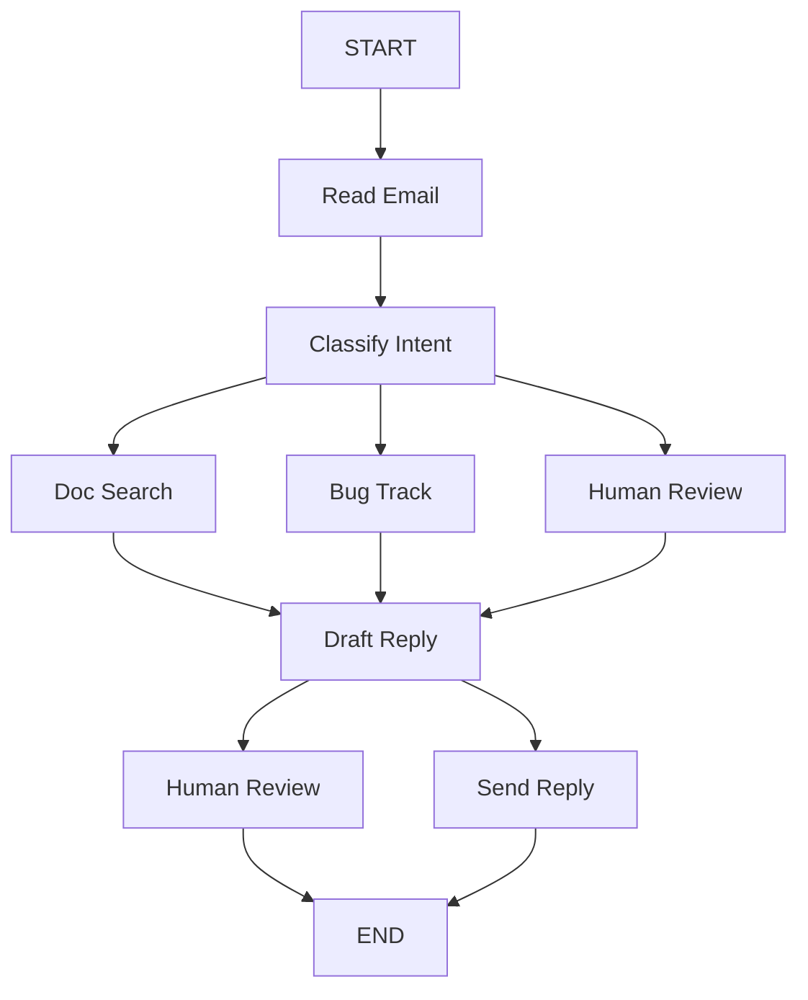

# Thinking In BeamWeaver

Build BeamWeaver systems by starting with the process, then choosing the
smallest runtime shape that makes the process reliable.

Use `BeamWeaver.Agent` when the workflow is a model/tool loop with middleware,
memory, and streaming. Use `BeamWeaver.Graph` when the workflow has explicit
steps, branches, fan-out, human review points, retries, or deterministic work
that should not be left to the model.


**BeamWeaver Shape**

LangGraph teaches you to split work into nodes connected by shared state.
BeamWeaver keeps that model, but uses Elixir maps, structs, reducers,
`%BeamWeaver.Graph.Command{}`, and supervised node execution instead of Python
`TypedDict`, `Annotated`, `Literal`, and generic type parameters.


## Start With The Process

Imagine a customer support email workflow:

```text
The system should:

- read incoming customer emails
- classify urgency and topic
- search relevant documentation
- create bug tickets when needed
- draft appropriate replies
- escalate risky cases to human reviewers
- send approved replies
```

Example cases:

1. Simple product question: "How do I reset my password?"
2. Bug report: "The export feature crashes when I select PDF format."
3. Urgent billing issue: "I was charged twice for my subscription."
4. Feature request: "Can you add dark mode to the mobile app?"
5. Complex technical issue: "Our API integration intermittently gets 504s."

Do not start by choosing a model. Start by drawing the process and deciding
which parts must be deterministic, reviewable, retried, or persisted.

## Step 1: Map The Workflow

Each meaningful step becomes either an agent capability or a graph node.



Node responsibilities:

- `Read Email`: Parse the inbound email and normalize sender metadata.
- `Classify Intent`: Categorize urgency, topic, and next route.
- `Doc Search`: Retrieve raw support documentation chunks.
- `Bug Track`: Create or update a ticket in an external tracker.
- `Draft Reply`: Generate a response from raw state.
- `Human Review`: Pause for approval or editing.
- `Send Reply`: Dispatch the final response.

Some nodes always move to the same next step. Others choose where to go next.
That routing decision should be explicit in the node return value or graph edge.

## Step 2: Choose Agent Or Graph

| Use | When |
| --- | --- |
| `BeamWeaver.Agent` | The model should decide when to call tools, and the workflow is mostly a standard model/tool loop. |
| `BeamWeaver.Graph` | You need explicit branches, deterministic actions, retries, fan-out, human pauses, or state repair. |
| Both | Embed a compiled agent graph inside a larger graph when part of the process is agentic and the rest is deterministic. |

For the support email workflow, use a graph if billing, bug creation, review,
and sending must follow auditable rules. Use an agent inside one node if the
drafting step needs flexible tool use.


**Do Not Hide Business Logic In Prompts**

If a rule controls money movement, production writes, compliance, escalation,
or customer-visible sends, model instructions are not enough. Put the rule in a
tool, middleware, graph node, conditional edge, or human-review step.


## Step 3: Identify Step Types

| Step type | Use for | BeamWeaver surface |
| --- | --- | --- |
| LLM step | Classify, reason, summarize, draft, choose among low-risk options. | `BeamWeaver.Core.ChatModel`, agent model nodes, structured output. |
| Data step | Fetch docs, customer history, tickets, records, or search results. | Tools, retrievers, graph nodes, `BeamWeaver.Memory`. |
| Action step | Send email, create ticket, charge payment, write data. | Tools or graph nodes with retries and review gates. |
| Human step | Approval, missing information, manual edits, escalation. | `BeamWeaver.Graph.interrupt/1` or HITL middleware. |
| Deterministic step | Counting, parsing, validation, policy checks, routing. | Plain Elixir functions in nodes or tools. |

Keep exact counting, file search, payment logic, and write authorization out of
the model. The model can request or interpret results; deterministic code should
produce the exact result.

## Step 4: Design State

State is the shared working memory for a graph run. Keep it raw. Do not store
formatted prompts or instructions in state.

Good state:

```elixir
%{
  email_id: "email-123",
  sender_email: "ada@example.com",
  email_content: "I was charged twice.",
  classification: nil,
  search_results: [],
  customer_history: nil,
  bug_ticket_id: nil,
  draft_response: nil,
  review_decision: nil,
  sent?: false
}
```

Poor state:

```elixir
%{
  prompt: "You are a support agent. The customer said...",
  formatted_docs: "Relevant documentation:\n- ...",
  llm_should_escalate_because: "Billing issue is probably critical"
}
```

Format prompts inside the node that calls the model. This lets different nodes
use the same raw data differently and keeps checkpointed state understandable.

Use reducers when multiple updates need merge behavior:

```elixir
graph =
  BeamWeaver.Graph.new(name: "SupportEmail")
  |> BeamWeaver.Graph.add_reducer(:messages, fn existing, update ->
    existing ++ List.wrap(update)
  end)
```

## Step 5: Build Nodes

A node is an Elixir function. It receives state, does one thing, and returns a
state update or command.

### Read Email

```elixir
read_email = fn state ->
  %{
    email_content: String.trim(state.email_content),
    sender_email: String.downcase(state.sender_email)
  }
end
```

### Classify And Route

Use a command when a node both updates state and chooses the next node:

```elixir
alias BeamWeaver.Graph.Command

classify_intent = fn state ->
  classification = MyApp.Support.classify_email(state.email_content, state.sender_email)

  next_node =
    cond do
      classification.urgency in [:critical, :high] -> :human_review
      classification.intent == :bug -> :bug_tracking
      classification.intent in [:question, :feature] -> :search_documentation
      true -> :draft_response
    end

  %Command{
    update: %{classification: classification},
    goto: next_node
  }
end
```

Add `destinations:` when the node has dynamic routes. It helps introspection and
makes the intended graph shape visible:

```elixir
Graph.add_node(graph, :classify_intent, classify_intent,
  destinations: [:human_review, :bug_tracking, :search_documentation, :draft_response]
)
```

### Search Documentation

Data steps should return raw data, not prompt-formatted text:

```elixir
search_documentation = fn state ->
  query = "#{state.classification.intent} #{state.classification.topic}"

  %{
    search_results: MyApp.KnowledgeBase.search(query, limit: 5)
  }
end
```

### Draft Reply

Format state into a prompt only at the model boundary:

```elixir
draft_response = fn state ->
  docs =
    state.search_results
    |> Enum.map_join("\n", fn doc -> "- #{doc.content}" end)

  prompt = """
  Draft a professional support reply.

  Original email:
  #{state.email_content}

  Classification:
  #{inspect(state.classification)}

  Relevant docs:
  #{docs}
  """

  {:ok, message} = BeamWeaver.Core.ChatModel.invoke(MyApp.SupportModel, prompt)

  needs_review? =
    state.classification.urgency in [:critical, :high] or
      state.classification.intent in [:billing, :complex]

  %Command{
    update: %{draft_response: BeamWeaver.Core.Message.text(message)},
    goto: if(needs_review?, do: :human_review, else: :send_reply)
  }
end
```

## Step 6: Handle Errors Deliberately

| Error type | Strategy |
| --- | --- |
| Transient network or rate-limit errors | Add retry policy and timeout at the node boundary. |
| LLM-recoverable tool errors | Store the error as state or a tool message and loop back. |
| Missing user information | Pause with `BeamWeaver.Graph.interrupt/1`. |
| Failure after retries | Use an error handler that routes to recovery or human review. |
| Unexpected bugs | Let them bubble up so telemetry, tests, and logs expose them. |

Add retry and timeout to nodes that call external services:

```elixir
Graph.add_node(graph, :search_documentation, search_documentation,
  retry: BeamWeaver.RetryPolicy.new!(
    max_attempts: 3,
    initial_delay: 250,
    backoff: 2.0,
    retry_on: :transient
  ),
  timeout: 10_000
)
```

Add a recovery branch when retry exhaustion should not fail the whole workflow:

```elixir
fallback_to_review = fn error, _state, _runtime ->
  %Command{
    update: %{search_error: error.message},
    goto: :human_review
  }
end

Graph.add_node(graph, :search_documentation, search_documentation,
  retry: BeamWeaver.RetryPolicy.new!(max_attempts: 3, retry_on: :transient),
  error_handler: fallback_to_review
)
```


**Retries Are Node Policy**

LangGraph examples use `RetryPolicy` and `error_handler` on Python nodes.
BeamWeaver exposes the same idea as Elixir node options: `retry:`,
`timeout:`, and `error_handler:`. Use those for external calls. Do not wrap
every node in broad `try/rescue`; only catch errors you can route or repair.


## Step 7: Add Human Input

Use `BeamWeaver.Agent.Middleware.HumanInTheLoop` for standard tool approval.
Use `BeamWeaver.Graph.interrupt/1` for custom graph pauses.

```elixir
human_review = fn state ->
  decision =
    BeamWeaver.Graph.interrupt(%{
      email_id: state.email_id,
      original_email: state.email_content,
      draft_response: state.draft_response,
      urgency: state.classification.urgency,
      action: "approve_or_edit"
    })

  if decision.approved do
    %Command{
      update: %{draft_response: decision.edited_response || state.draft_response},
      goto: :send_reply
    }
  else
    %Command{update: %{review_decision: decision}, goto: BeamWeaver.Graph.end_node()}
  end
end
```

Compile with a checkpointer when a graph can interrupt:

```elixir
checkpointer = BeamWeaver.Checkpoint.ETS.new()
config = %{"configurable" => %{"thread_id" => "email-123"}}

graph = Graph.compile!(workflow, checkpointer: checkpointer)

{:interrupted, interrupt} = BeamWeaver.Graph.Compiled.invoke(graph, state, config: config)
{:ok, final_state} = BeamWeaver.Graph.Compiled.resume(graph, %{interrupt.id => decision}, config: config)
```


**Interrupt Shape**

LangGraph Python examples resume with `Command(resume=...)` and may return
versioned `GraphOutput` values. BeamWeaver uses Elixir return tuples such as
`{:interrupted, interrupt}` and `BeamWeaver.Graph.Compiled.resume/3`. Use the
HITL middleware when you want standardized tool-review payloads.


## Step 8: Wire The Graph

The full graph is small because routing happens in command-returning nodes:

```elixir
alias BeamWeaver.Graph

workflow =
  Graph.new(name: "SupportEmail")
  |> Graph.add_node(:read_email, read_email)
  |> Graph.add_node(:classify_intent, classify_intent,
    destinations: [:human_review, :bug_tracking, :search_documentation, :draft_response]
  )
  |> Graph.add_node(:search_documentation, search_documentation,
    retry: BeamWeaver.RetryPolicy.new!(max_attempts: 3, retry_on: :transient),
    error_handler: fallback_to_review
  )
  |> Graph.add_node(:bug_tracking, bug_tracking,
    retry: BeamWeaver.RetryPolicy.new!(max_attempts: 3, retry_on: :transient)
  )
  |> Graph.add_node(:draft_response, draft_response,
    destinations: [:human_review, :send_reply]
  )
  |> Graph.add_node(:human_review, human_review,
    destinations: [:send_reply, BeamWeaver.Graph.end_node()]
  )
  |> Graph.add_node(:send_reply, send_reply)
  |> Graph.add_edge(:read_email, :classify_intent)
  |> Graph.add_edge(:search_documentation, :draft_response)
  |> Graph.add_edge(:bug_tracking, :draft_response)
  |> Graph.add_edge(Graph.start(), :read_email)
  |> Graph.add_edge(:send_reply, Graph.end_node())
  |> Graph.compile!()
```

You can also model routing with guarded `Graph.add_edge/4` declarations when
routes should be visible in the graph definition. Use commands when the node
naturally decides and updates state together.

## Node Granularity

Prefer smaller nodes when a boundary helps reliability:

- The step calls an external service.
- You need a checkpoint before or after it.
- You want retries only around that operation.
- You want to inspect state between decisions.
- You may need human review there later.

Larger nodes are acceptable when the operations are cheap, deterministic, and
always change together. Do not split so far that state becomes harder to reason
about than the original process.


**Durability Boundaries**

BeamWeaver checkpoints graph state at execution boundaries. Smaller nodes give
you more places to resume and inspect, but every boundary should represent a
real decision, external call, or meaningful state transition.
See [Durable Execution](durable_execution.md) for failure recovery and pending
writes. See [Fault Tolerance](fault_tolerance.md) for retries, timeouts, and
error handlers.


## Key Rules

- Keep business process rules in code, not only prompts.
- Store raw state. Format prompts on demand.
- Use agents for open-ended tool use; use graphs for explicit control flow.
- Use reducers when state needs additive merge behavior.
- Use commands for state update plus route selection.
- Put exact computation in Elixir nodes or tools.
- Add retries and timeouts at external-service boundaries.
- Use interrupts or HITL middleware before risky actions.
- Let unexpected errors surface.

## Related Guides

- [Quickstart](getting_started.md)
- [Workflows And Agents](workflows_and_agents.md)
- [Persistence](persistence.md)
- [Durable Execution](durable_execution.md)
- [Fault Tolerance](fault_tolerance.md)
- [Agents](agents.md)
- [Graph](graph.md)
- [Context Engineering](context_engineering.md)
- [Runtime](runtime.md)
- [Tools](tools.md)
- [Human-In-The-Loop](human_in_the_loop.md)
- [Short-Term Memory](short_term_memory.md)
- [Long-Term Memory](long_term_memory.md)
- [Event Streaming](event_streaming.md)
- [Tracing](tracing.md)
