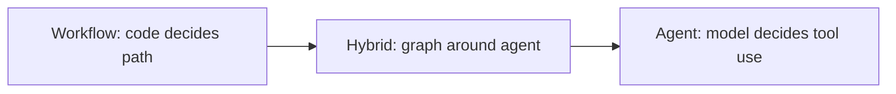

# Workflows And Agents

Workflows and agents are two ends of the same orchestration spectrum:

- **Workflows** follow predetermined code paths. The application decides the
  order of steps, branches, retries, and joins.
- **Agents** are dynamic. The model decides when to call tools and how to
  proceed within the boundaries you provide.

BeamWeaver supports both in one Elixir runtime. Use `BeamWeaver.Graph` for
explicit workflows, `use BeamWeaver.Agent` or `BeamWeaver.Agent.build/1` for a
standard model/tool loop, and compose the two when a product needs deterministic
control around an agentic step.




**BeamWeaver Shape**

LangGraph documents both a Python Graph API and a Python Functional API with
`@entrypoint` and `@task` decorators. BeamWeaver uses the graph API and ordinary
Elixir functions. Use local functions or `Task` for simple functional control
flow; use `BeamWeaver.Graph` when you need checkpointing, streaming, state
history, interrupts, retries, fan-out, or traceable orchestration metadata.


## Setup

Workflow examples can use any model that implements `BeamWeaver.Core.ChatModel`.
For provider-backed model calls, initialize a model and pass it into graph nodes
or agents:

```elixir
model = BeamWeaver.Models.init_chat_model!("anthropic:claude-sonnet-4-6")
```

For deterministic workflow tests, put exact business logic in Elixir nodes and
test those nodes without a live provider. For model behavior, use your
application's model adapter and credentials.


**Provider And Hosted Scope**

The LangGraph page uses Anthropic and links to LangSmith tracing, deployment,
and hosted LangGraph Platform features. BeamWeaver currently documents native
OpenAI, Anthropic, Google, xAI, fake-model, graph, checkpoint, memory,
telemetry, and tracing boundaries. Hosted LangSmith products, remote LangGraph
Platform APIs, and the
Python SDK/CLI contract are not BeamWeaver features.


## LLMs And Augmentations

Workflow and agent systems start with an LLM and the augmentations around it:
tools, structured output, memory, retries, middleware, and runtime context.

Structured output can be requested directly from a model:

```elixir
alias BeamWeaver.Models

search_schema = %{
  "type" => "object",
  "properties" => %{
    "search_query" => %{
      "type" => "string",
      "description" => "Query optimized for retrieval."
    },
    "justification" => %{
      "type" => "string",
      "description" => "Why this query is relevant."
    }
  },
  "required" => ["search_query", "justification"]
}

structured_model =
  model
  |> Models.with_structured_output(search_schema)
```

Tools let the model request actions:

```elixir
alias BeamWeaver.Core.Tool

multiply =
  Tool.from_function!(
    name: "multiply",
    description: "Multiply two integers.",
    input_schema: %{
      "type" => "object",
      "properties" => %{
        "a" => %{"type" => "integer"},
        "b" => %{"type" => "integer"}
      },
      "required" => ["a", "b"]
    },
    handler: fn input, _opts -> (input["a"] || input[:a]) * (input["b"] || input[:b]) end
  )
```

Agents bind those pieces into a graph-backed model/tool loop. Graphs let you
place model calls inside larger deterministic workflows.

## Prompt Chaining

Prompt chaining passes the output of one model call into the next. Use it when a
task can be split into ordered, inspectable steps.

```elixir
alias BeamWeaver.Core.{ChatModel, Message}
alias BeamWeaver.Graph
alias BeamWeaver.Graph.Compiled

generate_joke = fn state ->
  {:ok, message} =
    ChatModel.invoke(model, [
      Message.user("Write a short joke about #{state.topic}.")
    ])

  %{joke: Message.text(message)}
end

check_punchline = fn output ->
  String.contains?(output.joke, ["?", "!"])
end

improve_joke = fn state ->
  {:ok, message} =
    ChatModel.invoke(model, [
      Message.user("Make this joke funnier with wordplay: #{state.joke}")
    ])

  %{improved_joke: Message.text(message)}
end

polish_joke = fn state ->
  {:ok, message} =
    ChatModel.invoke(model, [
      Message.user("Add a surprising twist: #{state.improved_joke}")
    ])

  %{final_joke: Message.text(message)}
end

chain =
  Graph.new(name: "PromptChain")
  |> Graph.add_node(:generate_joke, generate_joke)
  |> Graph.add_node(:improve_joke, improve_joke)
  |> Graph.add_node(:polish_joke, polish_joke)
  |> Graph.add_edge(:generate_joke, Graph.end_node(), when: check_punchline)
  |> Graph.add_edge(:generate_joke, :improve_joke, default: true)
  |> Graph.add_edge(:improve_joke, :polish_joke)
  |> Graph.add_edge(Graph.start(), :generate_joke)
  |> Graph.add_edge(:polish_joke, Graph.end_node())
  |> Graph.compile!()

{:ok, state} = Compiled.invoke(chain, %{topic: "cats"})
```

Use prompt chaining when each step is meaningful on its own and a failed or
low-quality intermediate output should be visible in traces.

## Parallelization

Parallelization runs independent work at the same time and then joins the
results. This is useful when subtasks do not depend on each other, or when you
want multiple evaluations of the same output.

BeamWeaver can model fixed fan-out with independent start edges and `deps:`
fan-in:

```elixir
alias BeamWeaver.Core.{ChatModel, Message}
alias BeamWeaver.Graph
alias BeamWeaver.Graph.Compiled

write_joke = fn state ->
  {:ok, message} = ChatModel.invoke(model, [Message.user("Write a joke about #{state.topic}.")])
  %{joke: Message.text(message)}
end

write_story = fn state ->
  {:ok, message} = ChatModel.invoke(model, [Message.user("Write a story about #{state.topic}.")])
  %{story: Message.text(message)}
end

write_poem = fn state ->
  {:ok, message} = ChatModel.invoke(model, [Message.user("Write a poem about #{state.topic}.")])
  %{poem: Message.text(message)}
end

aggregate = fn state ->
  %{
    combined_output: """
    STORY:
    #{state.story}

    JOKE:
    #{state.joke}

    POEM:
    #{state.poem}
    """
  }
end

parallel =
  Graph.new(name: "ParallelDrafts")
  |> Graph.add_node(:write_joke, write_joke)
  |> Graph.add_node(:write_story, write_story)
  |> Graph.add_node(:write_poem, write_poem)
  |> Graph.add_node(:aggregate, aggregate, deps: [:write_joke, :write_story, :write_poem])
  |> Graph.add_edge(Graph.start(), :write_joke)
  |> Graph.add_edge(Graph.start(), :write_story)
  |> Graph.add_edge(Graph.start(), :write_poem)
  |> Graph.add_edge(:aggregate, Graph.end_node())
  |> Graph.compile!()

{:ok, state} = Compiled.invoke(parallel, %{topic: "cats"})
```

For model tool calls, `BeamWeaver.Graph.Nodes.ToolNode` also executes adjacent
concurrent tools in supervised groups by default.

## Research Review Pipeline

This shape starts from one planning node, runs branch workers as soon as the
plan is ready, verifies each branch independently, sends only failed branches
back for revision, and waits for both verified branches before final synthesis.

```elixir
research =
  Graph.new(name: "ResearchReview")
  |> Graph.add_reducer(:reviews, fn left, right -> Map.merge(left, right) end)
  |> Graph.add_node(:plan, PlanAgent)
  |> Graph.add_node(:facts, FactsAgent, deps: :plan)
  |> Graph.add_node(:market, MarketAgent, deps: :plan)
  |> Graph.add_node(:facts_check, FactsVerifier,
    deps: :facts,
    output: [:reviews, :facts]
  )
  |> Graph.add_node(:market_check, MarketVerifier,
    deps: :market,
    output: [:reviews, :market]
  )
  |> Graph.add_node(:final, SummaryAgent,
    deps: [:facts_check, :market_check],
    when: %{status: :accepted}
  )
  |> Graph.add_edge(Graph.start(), :plan)
  |> Graph.add_edge(:facts_check, :facts,
    when: %{status: :needs_revision},
    max_runs: 2
  )
  |> Graph.add_edge(:market_check, :market,
    when: %{status: :needs_revision},
    max_runs: 2
  )
  |> Graph.add_edge(:final, Graph.end_node())
  |> Graph.compile!()
```

## Routing

Routing first classifies input, then sends the workflow to a specialized path.
Keep routing logic in code when the branches are known; use a model with
structured output when the classification itself needs language understanding.

```elixir
alias BeamWeaver.Graph
alias BeamWeaver.Graph.Compiled

route = fn state ->
  cond do
    String.contains?(state.input, "poem") -> %{decision: :poem}
    String.contains?(state.input, "story") -> %{decision: :story}
    true -> %{decision: :joke}
  end
end

router =
  Graph.new(name: "Router")
  |> Graph.add_node(:route, route)
  |> Graph.add_node(:write_story, fn state -> %{output: "Story: #{state.input}"} end)
  |> Graph.add_node(:write_joke, fn state -> %{output: "Joke: #{state.input}"} end)
  |> Graph.add_node(:write_poem, fn state -> %{output: "Poem: #{state.input}"} end)
  |> Graph.add_edge(Graph.start(), :route)
  |> Graph.add_edge(:route, :write_story, when: %{decision: :story})
  |> Graph.add_edge(:route, :write_joke, when: %{decision: :joke})
  |> Graph.add_edge(:route, :write_poem, when: %{decision: :poem})
  |> Graph.add_edge(:write_story, Graph.end_node())
  |> Graph.add_edge(:write_joke, Graph.end_node())
  |> Graph.add_edge(:write_poem, Graph.end_node())
  |> Graph.compile!()

{:ok, state} = Compiled.invoke(router, %{input: "Write me a joke about cats"})
```

If a node should update state and choose the next destination together, return
`%BeamWeaver.Graph.Command{update: ..., goto: ...}` from that node.

## Orchestrator Worker

In an orchestrator-worker pattern, one step plans the work, workers execute the
subtasks, and a later step synthesizes the outputs. Use this when the number or
shape of subtasks is not known until runtime.

BeamWeaver uses `BeamWeaver.Graph.Send` for dynamic fan-out. Worker outputs that
need to merge back into shared state should use reducers.

```elixir
alias BeamWeaver.Graph
alias BeamWeaver.Graph.Compiled
alias BeamWeaver.Graph.Command
alias BeamWeaver.Graph.Send

plan_sections = fn state ->
  sections =
    state.topic
    |> String.split(" ")
    |> Enum.take(3)
    |> Enum.map(fn word -> %{name: word, description: "Section about #{word}"} end)

  sends = Enum.map(sections, fn section ->
    %Send{node: :write_section, update: %{section: section}}
  end)

  %Command{update: %{sections: sections}, goto: sends}
end

write_section = fn state ->
  %{completed_sections: ["## #{state.section.name}\n\n#{state.section.description}"]}
end

synthesize = fn state ->
  %{final_report: Enum.join(state.completed_sections, "\n\n---\n\n")}
end

orchestrator =
  Graph.new(name: "OrchestratorWorker")
  |> Graph.add_reducer(:completed_sections, fn existing, update ->
    existing ++ List.wrap(update)
  end)
  |> Graph.add_node(:plan_sections, plan_sections)
  |> Graph.add_node(:write_section, write_section)
  |> Graph.add_node(:synthesize, synthesize,
    deps: :write_section,
    when: fn _output, state -> length(state.completed_sections) == length(state.sections) end
  )
  |> Graph.add_edge(Graph.start(), :plan_sections)
  |> Graph.add_edge(:synthesize, Graph.end_node())
  |> Graph.compile!()

{:ok, state} =
  Compiled.invoke(orchestrator, %{
    topic: "LLM scaling laws",
    completed_sections: []
  })
```

For fixed worker sets, prefer `deps:` fan-in. For dynamic worker sets, use
reducers and an explicit completion condition so the synthesizer only runs once
all expected worker updates are present.

See [Durable Execution](durable_execution.md) for continuation and pending
writes. See [Fault Tolerance](fault_tolerance.md) for retries, timeouts, error
handlers, and failure policies.

## Evaluator Optimizer

Evaluator-optimizer workflows generate an answer, evaluate it, and loop with
feedback until a quality gate passes. Use this when success criteria are known
but the first draft is not reliably good enough.

```elixir
alias BeamWeaver.Graph
alias BeamWeaver.Graph.Compiled

generate = fn state ->
  prompt =
    if state[:feedback] do
      "Write a joke about #{state.topic}. Improve it using this feedback: #{state.feedback}"
    else
      "Write a joke about #{state.topic}."
    end

  {:ok, message} = BeamWeaver.Core.ChatModel.invoke(model, [BeamWeaver.Core.Message.user(prompt)])
  %{joke: BeamWeaver.Core.Message.text(message)}
end

evaluate = fn state ->
  if String.length(state.joke) > 40 do
    %{grade: :accepted, feedback: nil}
  else
    %{grade: :rejected, feedback: "Make the joke more specific."}
  end
end

optimizer =
  Graph.new(name: "EvaluatorOptimizer")
  |> Graph.add_node(:generate, generate)
  |> Graph.add_node(:evaluate, evaluate)
  |> Graph.add_edge(:generate, :evaluate)
  |> Graph.add_edge(:evaluate, Graph.end_node(), when: %{grade: :accepted})
  |> Graph.add_edge(:evaluate, :generate, when: %{grade: :rejected}, max_runs: 2)
  |> Graph.add_edge(Graph.start(), :generate)
  |> Graph.compile!()

{:ok, state} = Compiled.invoke(optimizer, %{topic: "cats"})
```

Real evaluators often use structured output, deterministic validation, or human
review. Add a retry or run limit around iterative loops so failed quality gates
do not run forever.

## Agents

Agents are model-driven loops. The model receives messages and tools, decides
whether to call a tool, sees the tool result, and continues until it can return
a final response.

Use `BeamWeaver.Agent.build/1` for runtime configuration:

```elixir
alias BeamWeaver.Agent
alias BeamWeaver.Core.{Message, Tool}

add =
  Tool.from_function!(
    name: "add",
    description: "Add two integers.",
    input_schema: %{
      "type" => "object",
      "properties" => %{
        "a" => %{"type" => "integer"},
        "b" => %{"type" => "integer"}
      },
      "required" => ["a", "b"]
    },
    handler: fn input, _opts -> (input["a"] || input[:a]) + (input["b"] || input[:b]) end
  )

{:ok, calculator_agent} =
  Agent.build(
    name: "calculator_agent",
    model: model,
    tools: [add],
    system_prompt: "You are a helpful assistant that performs arithmetic."
  )

{:ok, state} =
  Agent.invoke(calculator_agent, %{
    messages: [Message.user("Add 3 and 4.")]
  })
```

Use a module-defined agent when the behavior is stable application code:

```elixir
defmodule MyApp.CalculatorAgent do
  use BeamWeaver.Agent

  model BeamWeaver.Models.init_chat_model!("anthropic:claude-sonnet-4-6")
  tools [MyApp.Tools.Add, MyApp.Tools.Multiply, MyApp.Tools.Divide]
  system_prompt "You are a helpful assistant that performs arithmetic."
end
```

Agents are the right default when the process is open-ended. Use a workflow when
the process needs predictable branches, exact joins, product-specific state
transitions, or strict review gates.

## ToolNode

`BeamWeaver.Graph.Nodes.ToolNode` is the lower-level graph node that executes
tool calls. It is useful when you want to build a custom agent loop or place
tool execution inside a larger graph.

```elixir
alias BeamWeaver.Graph.Nodes.ToolNode

tools = [add]
tool_node = ToolNode.new(tools, timeout: 5_000)

tool_messages =
  ToolNode.invoke(tool_node, [
    %{"id" => "call_add", "name" => "add", "args" => %{"a" => 3, "b" => 4}}
  ])
```

In graph state, `ToolNode` reads assistant tool calls from `:messages` and
returns tool messages that your reducer appends. It handles parallel tool
execution, ordered results, error conversion, runtime injection, and graph
commands from tools.

## Pattern Selection

| Pattern | Use When | BeamWeaver Surface |
| --- | --- | --- |
| Prompt chaining | Ordered, verifiable LLM steps. | `Graph.add_edge/3` and intermediate state keys. |
| Parallelization | Independent subtasks can run together. | Multiple `Graph.start()` edges, `deps:` fan-in, `ToolNode` concurrency. |
| Routing | A classifier chooses one specialized path. | Guarded `Graph.add_edge/4` with `when:` or `%BeamWeaver.Graph.Command{}`. |
| Orchestrator worker | A planner creates dynamic subtasks. | `BeamWeaver.Graph.Send` plus reducers. |
| Evaluator optimizer | A draft is improved through feedback. | Conditional graph loops with explicit limits. |
| Agent | The model should decide tool use. | `use BeamWeaver.Agent`, `BeamWeaver.Agent.build/1`, and `ToolNode`. |


**Functional API Deviation**

LangGraph's Functional API examples use Python decorators and futures. BeamWeaver
does not expose those decorators. In Elixir, use normal functions for simple
local flows and use `BeamWeaver.Graph` when the flow needs durable execution,
streaming, interrupts, retries, reducers, or observable node boundaries.


## Related Guides

- [Overview](README.md)
- [Getting Started](getting_started.md)
- [Thinking In BeamWeaver](thinking_in_beamweaver.md)
- [Persistence](persistence.md)
- [Durable Execution](durable_execution.md)
- [Fault Tolerance](fault_tolerance.md)
- [Agents](agents.md)
- [Graph](graph.md)
- [Tools](tools.md)
- [Structured Output](structured_output.md)
- [Runtime](runtime.md)
- [Human-In-The-Loop](human_in_the_loop.md)
- [Event Streaming](event_streaming.md)
- [Tracing](tracing.md)
